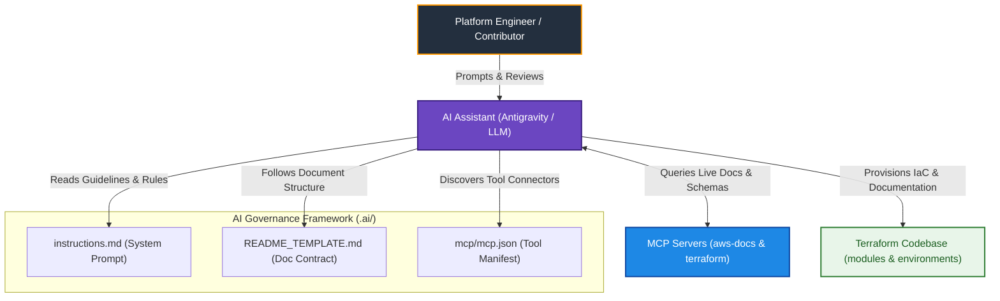
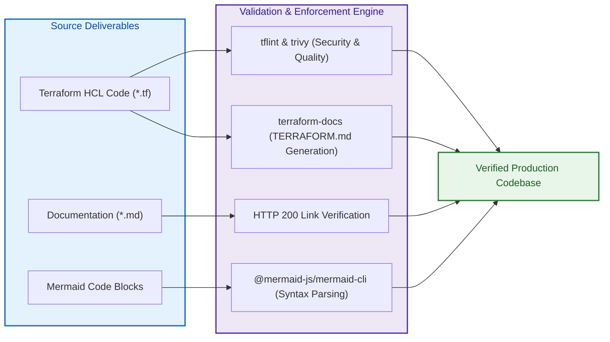

# AI Assistant Governance & Knowledge Framework (`.ai`)

[](file:///.ai/instructions.md)
[](https://modelcontextprotocol.io/)
[](https://mermaid.js.org/)
[](https://developer.hashicorp.com/terraform/docs)

---

## 1. Executive Summary

- **Purpose & Scope**:
  The `.ai/` directory houses the authoritative architectural guidelines, Model Context Protocol (MCP) integrations, system prompt instructions, and standardized documentation templates governing all AI-assisted engineering and human development across the **Databricks AWS Hub-and-Spoke VPC Networking** repository.
- **Problem Statement & Solution**:
  AI assistants operating without centralized project guardrails often introduce architectural drift, hallucinated resource attributes, deprecated Terraform provider syntax, or fragmented documentation formats. The `.ai/` framework eliminates this variability by enforcing deterministic sources of truth, live MCP documentation retrieval, standardized C4 architecture visualisations, and strict pre-commit quality gates.
- **Key Governance & Operational Outcomes**:
  - **Authoritative Source Hierarchy**: Grounds all network and security designs in official Databricks and AWS reference architectures, preventing hallucinations.
  - **Tool-Assisted Verification (MCP)**: Equips AI agents with live MCP servers (`aws-docs` and `terraform`) to query current AWS API limits, IAM policy requirements, and Terraform registry schema definitions.
  - **Standardized Documentation Contract**: Mandates a strict separation between consumer-facing architectural narrative ([`README.md`](file:///README.md)) and auto-generated machine interfaces (`TERRAFORM.md`).
  - **Zero-Error Diagrams**: Enforces programmatic syntax validation on all Mermaid diagrams before documentation commits.

---

## 2. General Logic & Operational Flow

### 2.1 AI Agent Lifecycle & Context Flow
1. **Context Initialization**:
   At the start of each engineering task, AI assistants load [`instructions.md`](file:///.ai/instructions.md) as the primary behavioral system prompt. This establishes the project boundary, architectural goals, coding conventions, and documentation standards.
2. **Authoritative Grounding & MCP Query**:
   When drafting or modifying Terraform resources, the assistant queries configured MCP servers defined in [`mcp/mcp.json`](file:///.ai/mcp/mcp.json) (`aws-docs` for AWS specifications and `terraform` for resource arguments) rather than relying on stale model memory.
3. **Execution & Modular Design**:
   Code changes adhere to the decoupled hub-and-spoke networking topology under `modules/` and orchestrated environments under `environments/`.
4. **Documentation & Validation Gate**:
   Any new or modified component must include a `README.md` following [`README_TEMPLATE.md`](file:///.ai/README_TEMPLATE.md). Mermaid diagrams must be tested against the live parser engine, and all URLs must be verified for HTTP 200 availability.

### 2.2 Model Context Protocol (MCP) Operational Integration
The repository integrates standard Model Context Protocol servers to provide real-time documentation retrieval:
- **`aws-docs`**: Provides access to AWS Developer Guides, API references, architecture frameworks, and section search.
- **`terraform`**: Provides access to Terraform registry provider details, module definitions, resource schemas, and deprecation notices.

---

## 3. Architecture of the `.ai/` Governance Framework

### 3.1 Directory Organization & Component Breakdown

```text
.ai/
├── README.md               # Overview and governance guide for the .ai directory
├── instructions.md         # Authoritative AI instructions, sources of truth, and rules
├── README_TEMPLATE.md      # Authoritative structural template for all README.md files
└── mcp/
    └── mcp.json            # Model Context Protocol server configuration
```

| File / Directory | Target Audience | Primary Function / Scope |
|:---|:---|:---|
| [`instructions.md`](file:///.ai/instructions.md) | AI Agents & Engineers | Primary system prompt establishing architectural standards, sources of truth, MCP protocols, and validation rules. |
| [`README_TEMPLATE.md`](file:///.ai/README_TEMPLATE.md) | AI Agents & Authors | Mandatory 7-section blueprint required for every environment and module `README.md` file. |
| [`mcp/mcp.json`](file:///.ai/mcp/mcp.json) | AI Assistants & IDEs | Configuration manifest for launching `aws-docs` and `terraform` MCP servers. |
| [`README.md`](file:///.ai/README.md) | All Developers | Navigational guide and governance manual for AI assistance within the repository. |

### 3.2 Authoritative Source Hierarchy
When resolving architectural or configuration questions, AI assistants and engineers must prioritize sources in the following strict order:
1. **Databricks Hub & Spoke Firewall Architecture Guide**: Primary pattern reference for central inspection routing.
2. **Databricks on AWS Official Documentation**: Primary source of truth for workspace, compute plane, and VPC requirements.
3. **AWS Documentation & Well-Architected Framework (via `aws-docs` MCP)**: Official guidance for VPC, Transit Gateway, Network Firewall, and KMS policies.
4. **Terraform AWS & Databricks Provider Registries (via `terraform` MCP)**: Canonical schema, arguments, and type constraints.

---

## 4. Architecture C4 Visualisation

### 4.1 Level 1: System Context Diagram
Illustrates how the AI governance layer interfaces between engineers, AI assistants, live documentation MCP servers, and the repository code.



### 4.2 Level 2: Quality & Validation Pipeline Diagram
Shows the automated checks that validate code, documentation, links, and diagrams created under this framework.



---

## 5. Components & Assets Inventory

### 5.1 Document Inventory

| Component | Path | Description | Key Enforcements |
|:---|:---|:---|:---|
| **System Instructions** | [`instructions.md`](file:///.ai/instructions.md) | Master instruction prompt for AI agents | Source of truth hierarchy, MCP usage rules, security posture, Mermaid syntax rules. |
| **README Template** | [`README_TEMPLATE.md`](file:///.ai/README_TEMPLATE.md) | Standardized markdown template | 7 mandatory sections, C4 diagrams, interface table links, link integrity rules. |
| **MCP Configuration** | [`mcp/mcp.json`](file:///.ai/mcp/mcp.json) | MCP tool launch definitions | `aws-docs` via `uvx` and `terraform` via `npx`. |

### 5.2 Mermaid Syntax Compliance Standards
To prevent syntax errors across markdown viewers, all Mermaid blocks must satisfy:
- **Subgraph Styling**: Never use `subgraph Id[...]:::className`. Always define `subgraph Id ["Title"]` and apply styles using `class Id className;` after the block.
- **Label Enclosure**: Always enclose node labels containing brackets, parentheses, colons, or slashes in double quotes (`["Label"]`).
- **No HTML Tags**: Prohibit raw HTML tags such as `<br/>` in labels; use standard text formatting.

---

## 6. Operating Guide & Developer Interface

### 6.1 Validating Mermaid Diagrams
To validate all Mermaid diagrams across the repository using `@mermaid-js/mermaid-cli`:

```bash
# Validate a single markdown document
npx @mermaid-js/mermaid-cli -i path/to/README.md -o /tmp/output.md

# Validate all documentation via the scratch runner
node C:\Users\msede\.gemini\antigravity-acp\brain\025d2dc6-4068-4702-913e-63bb88b147f3\scratch\validate_mermaid.mjs
```

### 6.2 Generating Terraform Interface Contracts
`TERRAFORM.md` files are maintained via `terraform-docs` and executed automatically via pre-commit hooks:

```bash
# Generate TERRAFORM.md for all modules and environments
terraform-docs markdown table --output-file TERRAFORM.md ./modules/01.networking/001.generic_vpc
terraform-docs markdown table --output-file TERRAFORM.md ./environments/dev
```

### 6.3 Using MCP Servers with AI Assistants
Ensure Python (`uv` / `uvx`) and Node.js (`npx`) are installed to run the configured MCP servers:
```json
{
  "mcpServers": {
    "aws-docs": {
      "command": "uvx",
      "args": ["awslabs.aws-documentation-mcp-server@latest"]
    },
    "terraform": {
      "command": "npx",
      "args": ["-y", "terraform-mcp-server"]
    }
  }
}
```

---

## 7. Important Links and Resources

### 7.1 Authoritative Reference Architectures
- [Official Databricks GitHub Repositories](https://github.com/orgs/databricks/repositories?type=all) - Authoritative catalog of official Databricks open-source repositories, reference implementations, and tooling.
- [Databricks Terraform Provider Examples](https://github.com/databricks/terraform-databricks-examples) - Examples of using Databricks Terraform provider (when deploying with AWS, use only AWS examples).
- [Databricks AWS E2 Firewall Hub and Spoke Guide](https://github.com/databricks/terraform-provider-databricks/blob/main/docs/guides/aws-e2-firewall-hub-and-spoke.md) - Reference pattern for centralized network firewall inspection.
- [Databricks on AWS Official Documentation](https://docs.databricks.com/aws/en/) - Core portal for Databricks cloud infrastructure.
- [AWS Network Firewall Developer Guide](https://docs.aws.amazon.com/network-firewall/latest/developerguide/what-is-aws-network-firewall.html) - Technical guide for AWS Network Firewall.
- [AWS Transit Gateway User Guide](https://docs.aws.amazon.com/vpc/latest/tgw/what-is-transit-gateway.html) - AWS Transit Gateway networking guide.

### 7.2 Tooling & Protocol Standards
- [Model Context Protocol (MCP) Documentation](https://modelcontextprotocol.io/) - Open standard for connecting AI models to tools and knowledge sources.
- [Mermaid.js Official Documentation](https://mermaid.js.org/) - Syntax and diagram generation specifications.
- [terraform-docs Documentation](https://terraform-docs.io/) - Automated interface documentation generation tool.
- [Terraform AWS Provider Documentation](https://registry.terraform.io/providers/hashicorp/aws/latest/docs) - HashiCorp AWS provider registry.

### 7.3 Internal Repository Links
- [Root Repository Overview](file:///README.md)
- [Project Instructions & Source of Truth](file:///.ai/instructions.md)
- [Authoritative README Template](file:///.ai/README_TEMPLATE.md)
- [Dev Environment Documentation](file:///environments/dev/README.md)
