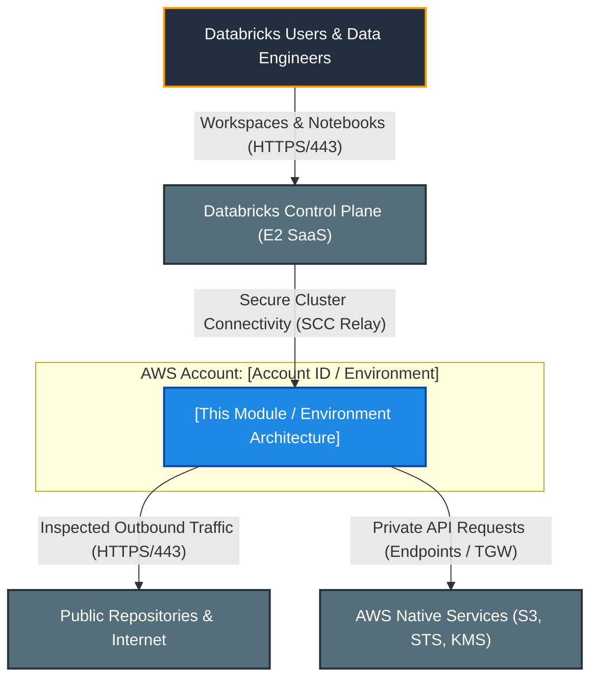
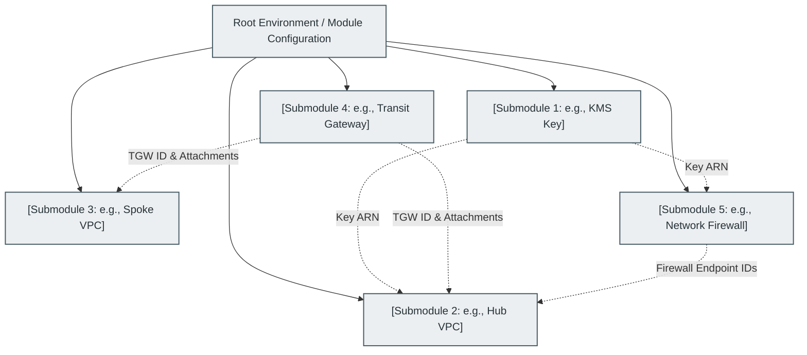

# Authoritative README Template for Modules and Environments

> **Template Version**: 1.1.0
> **Location**: `.ai/README_TEMPLATE.md`
> **Usage Instructions**:
> Every environment (under `environments/<env>/README.md`) and reusable module (under `modules/<category>/<module_name>/README.md`) **must** adhere strictly to this template structure. Replace placeholder bracketed text `[like this]` with component-specific details. Maintain all section headers and alert styles. Ensure all hyperlinks are verified and active (HTTP 200). Ensure all Mermaid diagrams are syntactically valid and tested before committing.

---

# [Module or Environment Title: e.g., Hub VPC Networking Module / Dev Environment]

<!-- Badges or metadata banner -->

---

## 1. Executive Summary

- **Purpose & Scope**:
  [Provide a high-level summary of what this module or environment provisions. Describe the role it plays within the overall Databricks AWS enterprise deployment (e.g., provisioning the Hub VPC with centralized AWS Network Firewall inspection, Spoke VPC compute infrastructure, KMS encryption keys, or state management).]
- **Problem Statement & Solution**:
  [Explain the technical challenge addressed—for example, isolating Databricks compute traffic while routing all Internet and cross-VPC egress through a centralized firewall without exposing worker nodes directly to the Internet.]
- **Key Business & Security Outcomes**:
  - **Zero Trust & Network Isolation**: [e.g., Strict subnet segmentation with zero public IPs on Databricks clusters].
  - **Compliance & Encryption**: [e.g., Customer-managed KMS encryption at rest across all state, storage, and log streams].
  - **Centralized Egress Inspection**: [e.g., All outbound traffic filtered by stateful SNI domain allowlists in AWS Network Firewall].
  - **Modular Architecture**: [e.g., Reusable, parameterized Terraform modules adhering to Infrastructure as Code (IaC) best practices].

---

## 2. General Logic & Operational Flow

[Detail the architectural reasoning, execution lifecycle, and traffic flows for this component.]

### 2.1 Configuration & Provisioning Lifecycle
1. **Variable Resolution & Locals Calculation**: [Explain how input variables and `locals.tf` compute network CIDRs, route table entries, tags, and naming conventions].
2. **Resource Dependency Sequencing**: [List the deployment sequence, e.g., KMS Key -> VPC & Subnets -> Route Tables -> Transit Gateway Attachment -> Firewall Endpoints].
3. **Validation & State Handling**: [Describe pre-commit validations, TFLint checks, and remote state backend locking].

### 2.2 Network & Traffic Flow
[Describe the path taken by data, control, and management packets. Provide concrete traffic paths:]
- **Outbound Egress (Databricks Clusters -> Internet / SaaS)**:
  `[Spoke Private Subnet]` $\rightarrow$ `[Spoke TGW Route Table]` $\rightarrow$ `[AWS Transit Gateway]` $\rightarrow$ `[Hub TGW Subnet]` $\rightarrow$ `[AWS Network Firewall]` $\rightarrow$ `[Hub NAT Gateway]` $\rightarrow$ `[Internet Gateway]` $\rightarrow$ `[Internet]`.
- **Databricks Control Plane Traffic**:
  [Describe whether traffic routes via Secure Cluster Connectivity (SCC) through the firewall allowlist or dedicated VPC endpoints / PrivateLink].
- **East-West Traffic (Spoke-to-Spoke / Spoke-to-On-Premises)**:
  [Describe transit routing, inspection rules, or direct peering constraints].

---

## 3. Architecture of the Module / Environment

[Provide a structured breakdown of the architectural tiers, network topologies, and security boundaries.]

### 3.1 Network Topology & Subnet Allocation
[Include a breakdown table of CIDR blocks, Availability Zones, and subnet classifications.]

| Tier / Subnet Name | Purpose | Availability Zones | CIDR Block / Mask | Route Table Target |
|:---|:---|:---:|:---:|:---|
| `[e.g., firewall]` | AWS Network Firewall Endpoints | AZ-a, AZ-b | `[e.g., 10.0.1.0/28, 10.0.1.16/28]` | IGW / NAT GW |
| `[e.g., public]` | NAT Gateways & Bastion | AZ-a, AZ-b | `[e.g., 10.0.2.0/28, 10.0.2.16/28]` | Internet Gateway |
| `[e.g., tgw_attachment]` | Transit Gateway VPC Attachment | AZ-a, AZ-b | `[e.g., 10.0.3.0/28, 10.0.3.16/28]` | Transit Gateway |
| `[e.g., private_compute]` | Databricks Worker Nodes | AZ-a, AZ-b | `[e.g., 10.1.0.0/18, 10.1.64.0/18]` | Transit Gateway |

### 3.2 Routing Matrix
[Summarize the routing tables and their associations.]

- **[Route Table 1 Name]**:
  - Destination `0.0.0.0/0` $\rightarrow$ Target `[e.g., vpce-firewall-id]`
  - Destination `[Spoke CIDR]` $\rightarrow$ Target `[e.g., tgw-id]`
- **[Route Table 2 Name]**:
  - Destination `0.0.0.0/0` $\rightarrow$ Target `[e.g., nat-gateway-id]`

### 3.3 Security, IAM & Encryption Posture
- **Encryption at Rest**: [Specify KMS key policies, aliases, key rotation, and service access].
- **Security Groups & NACLs**: [Describe ingress/egress rules, self-referencing cluster communication rules, and default-deny policies].
- **Firewall Policy & Rule Groups**: [Describe stateless vs stateful inspection, drop behavior, and SNI domain allowlists (e.g., Databricks control plane URLs, AWS STS, S3)].

---

## 4. Architecture C4 Visualisation

> [!IMPORTANT]
> **Mermaid Syntax Validation Rule**:
> All Mermaid diagrams **must be parsed and validated** for syntax correctness whenever created or updated (e.g., using `mmdc` / `@mermaid-js/mermaid-cli`).
> Follow these strict formatting rules:
> - **Subgraphs**: Never attach class definitions directly onto `subgraph` declaration lines (e.g., `subgraph Id[...]:::className` is invalid syntax). Declare `subgraph Id ["Title"]` and apply styling after the block using `class Id className;` or `style Id ...`.
> - **Node Labels**: Always enclose node labels in double quotes (e.g., `id["Label (Details)"]`) especially when containing parentheses, brackets, colons, slashes, or hyphens.
> - **No HTML in Labels**: Avoid HTML tags such as ` ` in node labels; use standard newlines or concise text descriptions.
> - **Diagram Types**: Use supported diagram headers (`flowchart TD`, `flowchart LR`, `graph TD`). Subgraph IDs must be valid alphanumeric identifiers without spaces.

### 4.1 Level 1: System Context Diagram
[Illustrates how the module or environment fits into the larger ecosystem, including users, Databricks Control Plane, and external services.]

### 4.2 Level 2: Container / Network Infrastructure Diagram
[Visualizes the VPCs, Transit Gateway, Network Firewall, Route Tables, and Subnet boundaries.]

```mermaid
flowchart LR
    classDef hubVpc fill:#E8F5E9,stroke:#2E7D32,stroke-width:2px,color:#1B5E20;
    classDef spokeVpc fill:#E3F2FD,stroke:#1565C0,stroke-width:2px,color:#0D47A1;
    classDef security fill:#FFF3E0,stroke:#E65100,stroke-width:2px,color:#BF360C;
    classDef transit fill:#EDE7F6,stroke:#512DA8,stroke-width:2px,color:#311B92;

    subgraph HubVPC ["Hub VPC (Inspection & Egress)"]
        IGW["Internet Gateway"]
        NAT["NAT Gateways (Multi-AZ)"]
        NFW["AWS Network Firewall Endpoints"]:::security
        HubTGWSubnet["Hub TGW Attachment Subnets"]
    end
    class HubVPC hubVpc;

    TGW["AWS Transit Gateway"]:::transit

    subgraph SpokeVPC ["Spoke VPC (Databricks Workspace Data Plane)"]
        SpokeTGWSubnet["Spoke TGW Attachment Subnets"]
        ComputeSubnets["Databricks Private Compute Subnets (Multi-AZ)"]
        WorkspaceClusters["Databricks Spark Clusters / Workers"]
    end
    class SpokeVPC spokeVpc;

    WorkspaceClusters --> ComputeSubnets
    ComputeSubnets --> SpokeTGWSubnet
    SpokeTGWSubnet -->|"VPC Attachment"| TGW
    TGW -->|"VPC Attachment"| HubTGWSubnet
    HubTGWSubnet --> NFW
    NFW --> NAT
    NAT --> IGW
    IGW -->|"Egress to Internet"| Internet((Public Internet))
```

### 4.3 Level 3: Component Diagram (Terraform Resource Orchestration)
[Shows the internal Terraform modules and resources comprising this setup.]

---

## 5. All Modules Used with Short Summaries

[Provide a comprehensive breakdown of all internal and external Terraform modules invoked. If documenting a standalone module, describe submodules used or downstream integration patterns.]

### 5.1 Module Inventory Table

| Module Name | Source Path | Version / Ref | Primary Role / Responsibility |
|:---|:---|:---:|:---|
| `[e.g., kms_key]` | `[../../modules/02.security/001.kms_key]` | `n/a` | Provisions multi-region KMS CMKs for S3, state, and firewall log encryption. |
| `[e.g., hub_vpc]` | `[../../modules/01.networking/003.hub_vpc]` | `n/a` | Deploys inspection VPC with IGW, NAT GWs, routing tables, and firewall subnets. |
| `[e.g., spoke_vpc]` | `[../../modules/01.networking/002.spoke_vpc]` | `n/a` | Deploys customer-managed VPC for Databricks compute with private-only subnets. |
| `[e.g., spoke_hub_transit_gateway]` | `[../../modules/01.networking/004.spoke_hub_tgw]` | `n/a` | Manages central Transit Gateway, route tables, associations, and VPC attachments. |
| `[e.g., hub_vpc_network_firewall]` | `[../../modules/01.networking/005.networking_firewall]` | `n/a` | Configures AWS Network Firewall with stateful SNI allowlists and logging. |
| `[e.g., backend_bucket]` | `[../../modules/03.storage/001.env_backend_bucket]` | `n/a` | Provisions encrypted, versioned S3 bucket and DynamoDB table for state locking. |

### 5.2 Deep-Dive Module Descriptions

#### 1. `[Module 1 Name]`
- **Source**: `[path/to/module]`
- **Purpose**: [Detailed explanation of why this module exists and how it contributes to the architecture].
- **Key Capabilities**:
  - [Capability 1]
  - [Capability 2]
- **Key Exposed Outputs**: `[output_1]`, `[output_2]`.

#### 2. `[Module 2 Name]`
- **Source**: `[path/to/module]`
- **Purpose**: [Detailed explanation].
- **Key Capabilities**:
  - [Capability 1]
  - [Capability 2]
- **Key Exposed Outputs**: `[output_1]`, `[output_2]`.

---

## 6. Terraform Documentation Interface

> [!NOTE]
> The full machine-generated Terraform interface (Providers, Modules, Inputs, Outputs, and Resource definitions) is maintained by `terraform-docs` via pre-commit hooks in [`TERRAFORM.md`](./TERRAFORM.md).
>
> Please refer directly to [`TERRAFORM.md`](./TERRAFORM.md) for detailed variable schemas, default values, and data structures.

### 6.1 Essential Inputs Summary
[Highlight the most critical 3–5 inputs that operators must specify.]

| Variable | Type | Description | Sample Value |
|:---|:---:|:---|:---|
| `[aws_account_id]` | `string` | Target AWS Account ID to prevent cross-account deployment | `"123456789012"` |
| `[aws_region]` | `string` | Deployment region | `"eu-central-1"` |
| `[environment]` | `string` | Environment qualifier (`dev`, `staging`, `prod`) | `"dev"` |

### 6.2 Essential Outputs Summary
[Highlight the most critical outputs exposed by this component.]

| Output | Description | Downstream Consumer |
|:---|:---|:---|
| `[vpc_id]` | Identifier of the provisioned VPC | Databricks MWS Network Registration |
| `[subnets_private_ids]` | Private subnet IDs for compute placement | Databricks Workspaces / Clusters |
| `[security_group_id]` | Default self-referencing security group ID | Databricks Cluster Networking |

---

## 7. Important Links and Resources

### 7.1 Authoritative Databricks Documentation
- [Databricks AWS E2 Firewall Hub and Spoke Architecture Guide](https://github.com/databricks/terraform-provider-databricks/blob/main/docs/guides/aws-e2-firewall-hub-and-spoke.md) - Reference pattern for centralized network firewall inspection.
- [Databricks on AWS Official Documentation](https://docs.databricks.com/aws/en/) - Core guide for Databricks cloud infrastructure on AWS.
- [Databricks Customer-Managed VPC Configuration Guide](https://docs.databricks.com/aws/en/administration-guide/cloud-configurations/aws/customer-managed-vpc) - Network, subnet, and security group prerequisites for Databricks compute.
- [Databricks Classic Private Connectivity & PrivateLink](https://docs.databricks.com/aws/en/security/network/classic/privatelink) - VPC endpoint configuration for front-end and back-end PrivateLink.
- [Databricks Terraform Provider Documentation](https://registry.terraform.io/providers/databricks/databricks/latest/docs) - Terraform registry provider guide for Databricks resources.

### 7.2 Authoritative AWS Documentation
- [AWS Official Documentation](https://docs.aws.amazon.com/) - Main portal for all AWS cloud service specifications.
- [AWS Network Firewall Developer Guide](https://docs.aws.amazon.com/network-firewall/latest/developerguide/what-is-aws-network-firewall.html) - Architecture, routing, and policy management for AWS Network Firewall.
- [AWS Transit Gateway Documentation](https://docs.aws.amazon.com/vpc/latest/tgw/what-is-transit-gateway.html) - Centralized hub-and-spoke interconnect guide.
- [AWS Well-Architected Framework](https://aws.amazon.com/architecture/well-architected/) - Security, reliability, performance, and operational excellence guidelines.

### 7.3 Terraform & Tooling Documentation
- [Terraform AWS Provider Registry Documentation](https://registry.terraform.io/providers/hashicorp/aws/latest/docs) - Resource and data source definitions for AWS.
- [Terraform Language Documentation](https://developer.hashicorp.com/terraform/docs) - HCL syntax, expressions, and configuration concepts.
- [terraform-docs Documentation](https://terraform-docs.io/) - Automated interface generation tool used for [`TERRAFORM.md`](./TERRAFORM.md).

### 7.4 Internal Repository References
- [Project Instructions & Source of Truth](file:///.ai/instructions.md) - Architectural guidelines and coding standards.
- [Authoritative README Template](file:///.ai/README_TEMPLATE.md) - This template specification.
