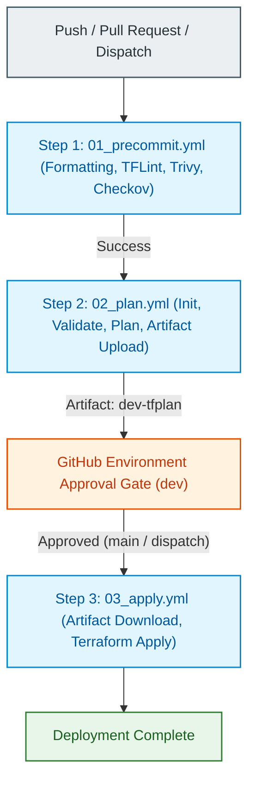
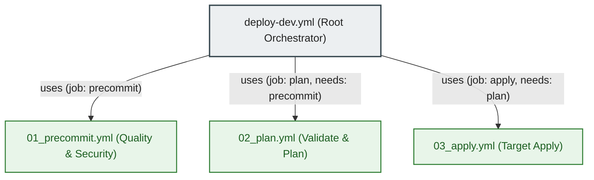

# GitHub Actions CI/CD & Deployment Workflows

---

## 1. Executive Summary

- **Purpose & Scope**:
  This directory contains the GitHub Actions automation workflows powering continuous integration, automated validation, and continuous delivery for the Databricks Hub-and-Spoke VPC networking infrastructure. It implements a reusable, multi-tier pipeline model ensuring that every pull request and push to protected branches is thoroughly validated, planned, and reviewed before changes reach AWS.
- **Problem Statement & Solution**:
  Deploying cloud networking and security components requires strict verification to avoid accidental outages, security group misconfigurations, or cross-account deployment drift. This CI/CD architecture splits validation into modular, reusable steps: pre-commit quality and security scanning, isolated Terraform plan generation with plan artifact caching, and environment-gated manual approval before apply execution.
- **Key Business & Security Outcomes**:
  - **Shift-Left Security & Linting**: Automatically checks code formatting, runs static analysis with TFLint, scans for misconfigurations and vulnerabilities with Trivy and Checkov, and blocks credential leaks with Gitleaks.
  - **Deterministic Deployments**: Plans are generated and saved as immutable binary artifacts (`tfplan`), guaranteeing that the exact reviewed plan is what gets executed during the apply phase.
  - **Environment Protection & Least Privilege**: Deployment to target AWS accounts is gated by GitHub Environment review approvals, using dedicated AWS credentials and role profiles.
  - **Modular Pipeline Reusability**: Pipeline stages are encapsulated into standalone `workflow_call` workflows, making multi-environment rollout (`dev`, `staging`, `prod`) seamless.

---

## 2. Workflow Orchestration & Operational Flow

### 2.1 Pipeline Lifecycle & Stages

1. **Step 1: Pre-commit Quality & Security Checks ([`01_precommit.yml`](file:///.github/workflows/01_precommit.yml))**:
   - Clones the repository and sets up Python tooling via `astral-sh/setup-uv`.
   - Initializes HashiCorp Terraform (`1.16.3`), TFLint with custom rules (`.tflint.hcl`), and Aqua Security Trivy (`setup-trivy`).
   - Runs pre-commit hooks across all files (formatting, linting, secret detection, security scanning) while skipping documentation generation.
2. **Step 2: Terraform Validate & Plan ([`02_plan.yml`](file:///.github/workflows/02_plan.yml))**:
   - Configures AWS credentials and generates AWS shared profile files.
   - Caches Terraform provider plugins (`.terraform` directory) keyed by `.terraform.lock.hcl`.
   - Checks code formatting, runs `terraform init`, and executes `terraform validate`.
   - Generates a speculative execution plan (`tfplan`) and human-readable plan summary (`tfplan.txt`).
   - Caches and uploads the binary plan artifact (5-day retention) and appends the plan summary to the GitHub Step Summary.
3. **Step 3: Terraform Apply ([`03_apply.yml`](file:///.github/workflows/03_apply.yml))**:
   - Gated by GitHub Environment protection rules (manual approval required in the GitHub UI).
   - Restricted to pushes on `main` or manual triggers via `workflow_dispatch`.
   - Restores cached provider plugins and initializes the backend.
   - Downloads the approved binary plan artifact from Step 2.
   - Executes `terraform apply tfplan` with non-interactive flags, preventing drift.

### 2.2 Trigger & Branching Strategy

| Event | Target Branches | Path Filtering | Automated Apply? |
|:---|:---:|:---|:---:|
| `pull_request` | `main`, `dev` | `environments/dev/**`, `modules/**`, config files, workflows | No (Pre-commit and Plan only) |
| `push` | `dev` | `environments/dev/**`, `modules/**`, config files, workflows | No (Pre-commit and Plan only) |
| `push` | `main` | `environments/dev/**`, `modules/**`, config files, workflows | Yes (Gated by Environment Approval) |
| `workflow_dispatch` | Any branch | None (Manual selection) | Yes (If approved) |

---

## 3. Architecture of the Workflows

### 3.1 Workflow Hierarchy & Configuration

### 3.2 Security, Permissions & OIDC Posture
- **Minimal Permissions Boundary**: The root workflow explicitly declares least-privilege token permissions:
  - `contents: read`: Repository checkout.
  - `id-token: write`: OpenID Connect (OIDC) token generation for AWS IAM federation.
  - `pull-requests: write`: Attaching plan summaries to pull requests.
- **Plan Immutability**: The plan artifact generated in Step 2 is stored as a binary archive and executed in Step 3 without re-evaluating interpolations or recalculating dynamic variables.
- **Provider Caching**: Restoring provider plugins based on `.terraform.lock.hcl` hashes accelerates pipeline execution while guarding against upstream registry tampering.

---

## 4. Workflow Inventory

| Workflow File | Trigger Type | Primary Role | Key Inputs / Defaults |
|:---|:---:|:---|:---|
| [`deploy-dev.yml`](file:///.github/workflows/deploy-dev.yml) | `push`, `pull_request`, `workflow_dispatch` | Root pipeline coordinator for the `dev` environment | `auto_apply: false` |
| [`01_precommit.yml`](file:///.github/workflows/01_precommit.yml) | `workflow_call` | Runs linting, syntax formatting, and multi-engine security scans | `terraform_version: 1.16.3`, `tflint_version: latest`, `trivy_version: latest` |
| [`02_plan.yml`](file:///.github/workflows/02_plan.yml) | `workflow_call` | Validates configuration, runs `terraform plan`, and uploads plan artifact | `working_directory: environments/dev`, `environment: dev`, `plan_artifact_name: dev-tfplan` |
| [`03_apply.yml`](file:///.github/workflows/03_apply.yml) | `workflow_call` | Downloads plan artifact and executes `terraform apply` under environment gates | `working_directory: environments/dev`, `environment: dev`, `plan_artifact_name: dev-tfplan` |

---

## 5. Required Secrets and Variables

To execute the pipelines successfully, the following repository secrets and variables must be configured in GitHub repository settings:

### 5.1 Repository Secrets

| Secret Name | Purpose | Required By |
|:---|:---|:---:|
| `AWS_ACCESS_KEY_ID` | AWS deployment credentials access key | `02_plan.yml`, `03_apply.yml` |
| `AWS_SECRET_ACCESS_KEY` | AWS deployment credentials secret key | `02_plan.yml`, `03_apply.yml` |
| `AWS_SESSION_TOKEN` | Optional session token for temporary STS credentials | `02_plan.yml`, `03_apply.yml` |
| `AWS_PROFILE_ROLE_ARN` | IAM role ARN for assumed profile execution | `02_plan.yml`, `03_apply.yml` |
| `AWS_ACCOUNT_ID` | Allowed AWS Account ID for cross-account protection | `02_plan.yml`, `03_apply.yml` |
| `AWS_REGION` | Target AWS deployment region (defaults to `eu-central-1`) | `02_plan.yml`, `03_apply.yml` |

### 5.2 GitHub Environment Setup
- Create an environment named `dev` under **Settings** $\rightarrow$ **Environments**.
- Configure **Deployment protection rules** (e.g., required reviewers) to enforce manual approvals before `03_apply.yml` executes.

---

## 6. Important Links and Resources

### 6.1 Authoritative Documentation
- [GitHub Actions Documentation](https://docs.github.com/en/actions) - Official GitHub Actions documentation.
- [HashiCorp Setup Terraform Action](https://github.com/hashicorp/setup-terraform) - Official Terraform installer action.
- [AWS Configure AWS Credentials Action](https://github.com/aws-actions/configure-aws-credentials) - Official AWS credential provider action.
- [Astral Setup uv Action](https://github.com/astral-sh/setup-uv) - Fast Python package and tool installer action.
- [TFLint GitHub Action](https://github.com/terraform-linters/setup-tflint) - TFLint installer action.
- [Aqua Security Setup Trivy Action](https://github.com/aquasecurity/setup-trivy) - Trivy security scanner action.

### 6.2 Internal References
- [Root Deployment Pipeline](file:///.github/workflows/deploy-dev.yml)
- [Pre-commit Workflow](file:///.github/workflows/01_precommit.yml)
- [Terraform Plan Workflow](file:///.github/workflows/02_plan.yml)
- [Terraform Apply Workflow](file:///.github/workflows/03_apply.yml)
- [Project Instructions & Source of Truth](file:///.ai/instructions.md)
