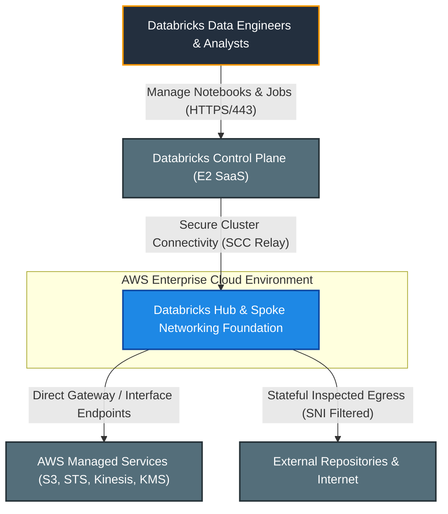
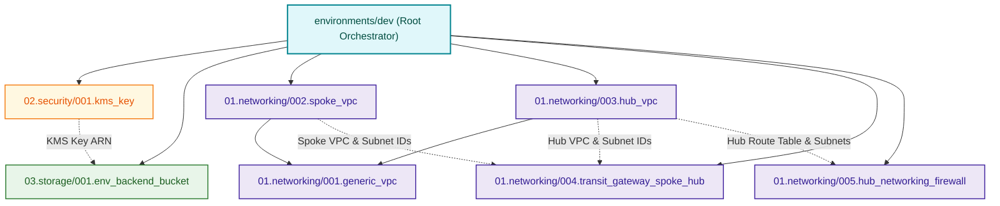

# Enterprise Databricks AWS Hub-and-Spoke VPC Networking

[](https://developer.hashicorp.com/terraform/docs)
[](https://registry.terraform.io/providers/hashicorp/aws/latest/docs)
[](https://registry.terraform.io/providers/databricks/databricks/latest/docs)
[](https://github.com/databricks/terraform-provider-databricks/blob/main/docs/guides/aws-e2-firewall-hub-and-spoke.md)
[](file:///.github/README.md)

---

## 1. Executive Summary

- **Purpose & Scope**:
  This repository provisions an enterprise-grade AWS network foundation for **Databricks E2 Workspaces** using a centralized **Hub-and-Spoke Firewall Architecture**. It implements production-ready infrastructure-as-code (IaC) via modular Terraform, isolating Databricks compute resources within private customer-managed VPCs while routing all outbound traffic through a centralized inspection Hub equipped with AWS Network Firewall and AWS Transit Gateway.
- **Problem Statement & Solution**:
  Enterprise data platforms require strict perimeter security, exfiltration prevention, and compliance with zero-trust networking standards. Deploying Databricks clusters with direct public Internet access creates data exfiltration risks and regulatory non-compliance. This solution resolves that challenge by eliminating public IPs on Databricks clusters and enforcing centralized, stateful FQDN/domain inspection on all outbound egress traffic via AWS Network Firewall and AWS Transit Gateway.
- **Key Business & Security Outcomes**:
  - **Zero Direct Internet Exposure**: Databricks worker nodes reside exclusively in private subnets with no public IPs or internet gateways.
  - **Centralized Egress & Exfiltration Control**: Outbound traffic is inspected by stateful AWS Network Firewall rules restricting egress to verified Databricks control plane URLs and authorized repositories.
  - **Complete Data Encryption**: Customer-managed KMS keys (CMKs) enforce envelope encryption at rest across Terraform state, storage buckets, and firewall logs.
  - **Scalable Multi-VPC Interconnect**: AWS Transit Gateway (TGW) serves as a cloud router, enabling multi-account and multi-workspace scalability.
  - **Automated Quality & Compliance**: Enforced pre-commit hooks featuring `tflint`, `trivy`, `checkov`, `gitleaks`, and `terraform-docs` integrated into multi-stage GitHub Actions CI/CD pipelines.

---

## 2. General Logic & Operational Flow

### 2.1 Project Lifecycle & Execution Workflow
1. **Security & State Backend Initialization**:
   The KMS key module ([`001.kms_key`](file:///modules/02.security/001.kms_key)) provisions a dedicated CMK. The backend storage module ([`001.env_backend_bucket`](file:///modules/03.storage/001.env_backend_bucket)) provisions an S3 state bucket encrypted with this CMK, featuring automated 90-day non-current version lifecycle expiration.
2. **Foundational VPC Containers**:
   Both Spoke and Hub network modules instantiate the base VPC primitive ([`001.generic_vpc`](file:///modules/01.networking/001.generic_vpc)) to establish isolated VPC containers with DNS hostnames and DNS support explicitly enabled.
3. **Spoke VPC Provisioning**:
   The Spoke VPC module ([`002.spoke_vpc`](file:///modules/01.networking/002.spoke_vpc)) allocates private compute subnets for Databricks clusters, TGW attachment subnets, self-referencing cluster security groups, and local VPC endpoints (Gateway S3, Interface STS, Interface Kinesis).
4. **Hub VPC Provisioning**:
   The Hub VPC module ([`003.hub_vpc`](file:///modules/01.networking/003.hub_vpc)) deploys the public NAT Gateways, Internet Gateway (IGW), TGW attachment subnets, firewall subnets, and routing tables.
5. **Transit Gateway Interconnect**:
   The Transit Gateway module ([`004.transit_gateway_spoke_hub`](file:///modules/01.networking/004.transit_gateway_spoke_hub)) attaches both the Spoke and Hub VPCs to the central AWS Transit Gateway, configuring symmetric routing between VPCs.
6. **Firewall Inspection & Egress Routing**:
   The Network Firewall module ([`005.hub_networking_firewall`](file:///modules/01.networking/005.hub_networking_firewall)) provisions the AWS Network Firewall into the Hub VPC firewall subnets, wires endpoint route tables, and enforces stateful domain allowlists.

### 2.2 End-to-End Traffic Flow
- **Outbound Databricks Cluster Egress**:
  Databricks compute node $\rightarrow$ Spoke private subnet route table $\rightarrow$ AWS Transit Gateway $\rightarrow$ Hub TGW subnet $\rightarrow$ Hub NAT Gateway $\rightarrow$ AWS Network Firewall endpoint $\rightarrow$ Internet Gateway $\rightarrow$ Public Internet / SaaS.
- **AWS Service Traffic (In-VPC Optimization)**:
  Databricks compute nodes access Amazon S3 directly via the Gateway VPC Endpoint without leaving the Spoke VPC. STS and Kinesis traffic is routed through local Interface VPC Endpoints.
- **Databricks Control Plane Communication**:
  Secure Cluster Connectivity (SCC) initiates outbound encrypted TLS connections through the central firewall to the Databricks control plane relay.

### 2.3 Automated CI/CD & Delivery Model
All changes undergo automated validation and delivery managed via GitHub Actions:
- **Quality & Security Scanning**: [`01_precommit.yml`](file:///.github/workflows/01_precommit.yml) runs static linting (`tflint`), vulnerability scanning (`trivy`), infrastructure-as-code analysis (`checkov`), and secret detection (`gitleaks`).
- **Deterministic Planning**: [`02_plan.yml`](file:///.github/workflows/02_plan.yml) validates configurations, generates speculative execution plans, and caches immutable plan artifacts (`tfplan`).
- **Gated Delivery**: [`03_apply.yml`](file:///.github/workflows/03_apply.yml) executes applies against target environments under manual review protection gates.
- For detailed pipeline architecture, see the [GitHub Actions Documentation](file:///.github/README.md).

---

## 3. Architecture of the Project

### 3.1 Network Topology & CIDR Allocation

| Network Tier / VPC | Subnet Classification | Purpose | Route Target |
|:---|:---|:---|:---|
| **Hub VPC (`10.0.0.0/20`)** | `hub-nat-public` | Egress NAT Gateways & Bastion | Internet Gateway (`hub-igw`) |
| **Hub VPC (`10.0.0.0/20`)** | `hub-firewall-subnet` | AWS Network Firewall Endpoints | Egress Inspection Pipeline |
| **Hub VPC (`10.0.0.0/20`)** | `hub-tgw-private` | Transit Gateway Hub Attachment | NAT Gateway & TGW Router |
| **Spoke VPC (`10.1.0.0/16`)** | `spoke-db-private` | Databricks Spark Workers / Compute | Transit Gateway (`tgw`) & S3 VPCE |
| **Spoke VPC (`10.1.0.0/16`)** | `spoke-tgw-private` | Transit Gateway Spoke Attachment | Transit Gateway (`tgw`) |

### 3.2 Security Posture & Boundary Controls
- **KMS Key Management**: Customer-managed KMS key with automatic rotation, deletion protection, and root/caller identity delegation.
- **Security Groups**: Default Databricks security group enforcing self-referencing ingress/egress for intra-cluster communication and restricted TCP egress (443, 3306, 6666).
- **Network Firewall Policy**: Stateful inspection rule groups with domain allowlists for Databricks infrastructure, metastores, and whitelisted S3 storage buckets.

---

## 4. Architecture C4 Visualisation

### 4.1 Level 1: System Context Diagram
Shows how the Databricks environment interacts with users, the Databricks Control Plane, AWS native services, and external endpoints.



### 4.2 Level 2: Container / Network Infrastructure Diagram
Illustrates the network topology spanning the Hub VPC, Spoke VPC, Transit Gateway, and AWS Network Firewall.

```mermaid
flowchart LR
    classDef hubVpc fill:#E8F5E9,stroke:#2E7D32,stroke-width:2px,color:#1B5E20;
    classDef spokeVpc fill:#E3F2FD,stroke:#1565C0,stroke-width:2px,color:#0D47A1;
    classDef security fill:#FFF3E0,stroke:#E65100,stroke-width:2px,color:#BF360C;
    classDef transit fill:#EDE7F6,stroke:#512DA8,stroke-width:2px,color:#311B92;

    subgraph HubVPC ["Hub VPC (Central Inspection & Egress)"]
        IGW["Internet Gateway (hub-igw)"]
        NAT["NAT Gateway (hub-nat)"]
        NFW["AWS Network Firewall (Stateful Rules)"]:::security
        HubTGWSubnet["Hub TGW Attachment Subnets"]
    end
    class HubVPC hubVpc;

    TGW["AWS Transit Gateway (tgw-spoke-hub)"]:::transit

    subgraph SpokeVPC ["Spoke VPC (Customer-Managed Databricks Compute)"]
        SpokeTGWSubnet["Spoke TGW Attachment Subnets"]
        ComputeSubnets["Databricks Compute Subnets (Multi-AZ)"]
        S3VPCE["S3 Gateway Endpoint"]
        STSKinesisVPCE["STS & Kinesis Interface Endpoints"]
        SparkNodes["Databricks Compute Clusters"]
    end
    class SpokeVPC spokeVpc;

    SparkNodes --> ComputeSubnets
    ComputeSubnets --> S3VPCE
    ComputeSubnets --> STSKinesisVPCE
    ComputeSubnets -->|"Default Egress 0.0.0.0/0"| SpokeTGWSubnet
    SpokeTGWSubnet -->|"VPC Attachment"| TGW
    TGW -->|"VPC Attachment"| HubTGWSubnet
    HubTGWSubnet --> NAT
    NAT --> NFW
    NFW --> IGW
    IGW -->|"Inspected Egress"| Internet((Public Internet))
```



### 4.3 Level 3: Component Diagram (Terraform Architecture)
Depicts the modular orchestration of Terraform components across environments and modules.



---

## 5. All Modules Used with Short Summaries

The repository is structured into isolated, reusable Terraform modules under `modules/` and orchestrated environments under `environments/`.

### 5.1 Repository Module Inventory

| Module Path | Module Name | Primary Role & Responsibilities |
|:---|:---|:---|
| [`modules/01.networking/001.generic_vpc`](file:///modules/01.networking/001.generic_vpc) | `001.generic_vpc` | Base primitive provisioning an AWS VPC with DNS hostnames and DNS support enabled. |
| [`modules/01.networking/002.spoke_vpc`](file:///modules/01.networking/002.spoke_vpc) | `002.spoke_vpc` | Databricks customer-managed VPC with private compute subnets, cluster security groups, and VPC endpoints. |
| [`modules/01.networking/003.hub_vpc`](file:///modules/01.networking/003.hub_vpc) | `003.hub_vpc` | Centralized Hub VPC with NAT Gateways, Internet Gateway, firewall subnets, and routing tables. |
| [`modules/01.networking/004.transit_gateway_spoke_hub`](file:///modules/01.networking/004.transit_gateway_spoke_hub) | `004.transit_gateway_spoke_hub` | AWS Transit Gateway interconnect managing VPC attachments, route tables, and cross-VPC propagation. |
| [`modules/01.networking/005.hub_networking_firewall`](file:///modules/01.networking/005.hub_networking_firewall) | `005.hub_networking_firewall` | AWS Network Firewall deploying stateful rule groups, FQDN domain allowlists, and symmetric inspection routing. |
| [`modules/02.security/001.kms_key`](file:///modules/02.security/001.kms_key) | `001.kms_key` | Customer Managed Key (CMK) provisioning with deletion protection, automated rotation, and key policy management. |
| [`modules/03.storage/001.env_backend_bucket`](file:///modules/03.storage/001.env_backend_bucket) | `001.env_backend_bucket` | Hardened S3 state storage with SSE-KMS encryption, versioning, ownership controls, 90-day lifecycle expiration, and public access blocks. |

---

## 6. Directory Structure & Environments

```text
├── .ai/                                  # AI guidelines, governance, and templates
│   ├── README.md                         # Overview and governance guide for the .ai directory
│   ├── instructions.md                   # Authoritative system instructions & sources of truth
│   ├── README_TEMPLATE.md                # Mandatory template for all README.md files
│   └── mcp/                              # Model Context Protocol configurations
│       └── mcp.json                      # MCP server definitions (aws-docs, terraform)
├── .github/                              # CI/CD deployment pipelines & automation workflows
│   ├── README.md                         # Comprehensive CI/CD architecture & documentation
│   └── workflows/                        # GitHub Actions workflow definitions
│       ├── deploy-dev.yml                # Dev environment pipeline orchestrator
│       ├── 01_precommit.yml              # Reusable pre-commit & security scans
│       ├── 02_plan.yml                   # Reusable Terraform plan & artifact cache
│       └── 03_apply.yml                  # Reusable gated Terraform apply
├── environments/                         # Deployment environment orchestration
│   └── dev/                              # Development environment configuration
│       ├── main.tf                       # Module orchestration entrypoint
│       ├── variables.tf                  # Environment input variables
│       ├── locals.tf                     # Calculated CIDRs, tags, allowlists
│       ├── providers.tf                  # AWS provider configurations
│       ├── backend.tf                    # Remote S3 state backend config
│       ├── README.md                     # Comprehensive environment documentation
│       └── TERRAFORM.md                  # Auto-generated terraform-docs contract
├── modules/                              # Reusable Terraform modules
│   ├── 01.networking/                    # Networking modules (VPC, TGW, Firewall)
│   │   ├── 001.generic_vpc/              # Base VPC container primitive
│   │   ├── 002.spoke_vpc/                # Customer-managed Databricks compute VPC
│   │   ├── 003.hub_vpc/                  # Centralized inspection and egress Hub VPC
│   │   ├── 004.transit_gateway_spoke_hub/# Transit Gateway interconnect & routing
│   │   └── 005.hub_networking_firewall/  # AWS Network Firewall & domain filtering
│   ├── 02.security/                      # Security and encryption modules
│   │   └── 001.kms_key/                  # Customer Managed Key (CMK) & policies
│   └── 03.storage/                       # Storage modules
│       └── 001.env_backend_bucket/       # Hardened S3 state storage bucket
├── .pre-commit-config.yaml               # Quality, security, and linting hooks
├── .tflint.hcl                           # TFLint configuration
├── .trivyignore                          # Trivy scanner exclusions
└── pyproject.toml                        # Python environment & tooling definitions
```

---

## 7. Terraform Documentation Interface

> [!NOTE]
> Detailed interface contracts for each module and environment are generated automatically by `terraform-docs` via pre-commit hooks and saved in dedicated `TERRAFORM.md` files:
> - Environment contract: [`environments/dev/TERRAFORM.md`](file:///environments/dev/TERRAFORM.md)
> - Module contracts: [`modules/**/TERRAFORM.md`](file:///modules)

---

## 8. Important Links and Resources

### 8.1 Authoritative Databricks Documentation
- [Databricks AWS E2 Firewall Hub and Spoke Guide](https://github.com/databricks/terraform-provider-databricks/blob/main/docs/guides/aws-e2-firewall-hub-and-spoke.md) - Official Databricks reference guide for central firewall architectures.
- [Databricks on AWS Official Documentation](https://docs.databricks.com/aws/en/) - Core portal for Databricks cloud infrastructure.
- [Databricks Customer-Managed VPC Guide](https://docs.databricks.com/aws/en/administration-guide/cloud-configurations/aws/customer-managed-vpc) - Network and subnet specifications for Databricks compute planes.
- [Databricks Classic Private Connectivity & PrivateLink](https://docs.databricks.com/aws/en/security/network/classic/privatelink) - VPC endpoint setup for PrivateLink.
- [Databricks Terraform Provider Documentation](https://registry.terraform.io/providers/databricks/databricks/latest/docs) - Databricks Terraform registry documentation.

### 8.2 Authoritative AWS Documentation
- [AWS Official Documentation](https://docs.aws.amazon.com/) - AWS documentation portal.
- [AWS Network Firewall Developer Guide](https://docs.aws.amazon.com/network-firewall/latest/developerguide/what-is-aws-network-firewall.html) - Technical guide for AWS Network Firewall.
- [AWS Transit Gateway Documentation](https://docs.aws.amazon.com/vpc/latest/tgw/what-is-transit-gateway.html) - AWS Transit Gateway user guide.
- [AWS Well-Architected Framework](https://aws.amazon.com/architecture/well-architected/) - Architectural best practices for cloud workloads.

### 8.3 Project Documentation References
- [AI Governance & Knowledge Framework](file:///.ai/README.md)
- [Project Guidelines & Source of Truth](file:///.ai/instructions.md)
- [Authoritative README Template](file:///.ai/README_TEMPLATE.md)
- [GitHub Actions Workflows Documentation](file:///.github/README.md)
