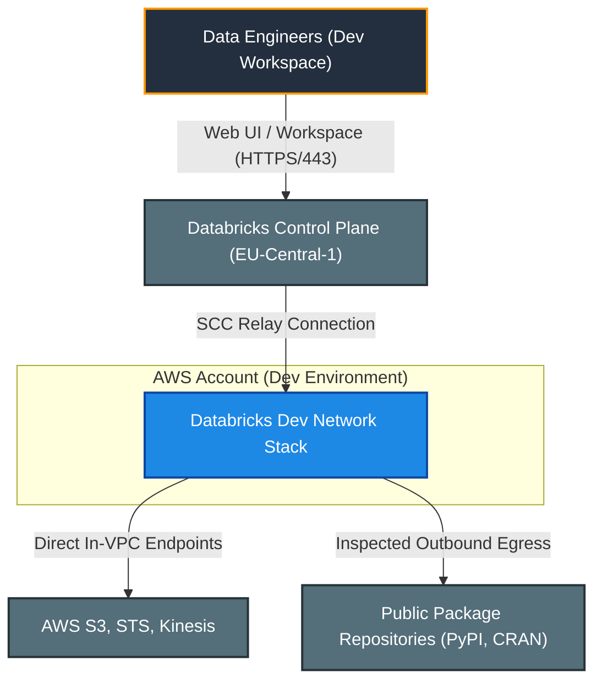
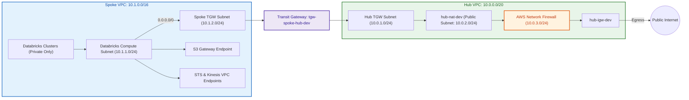
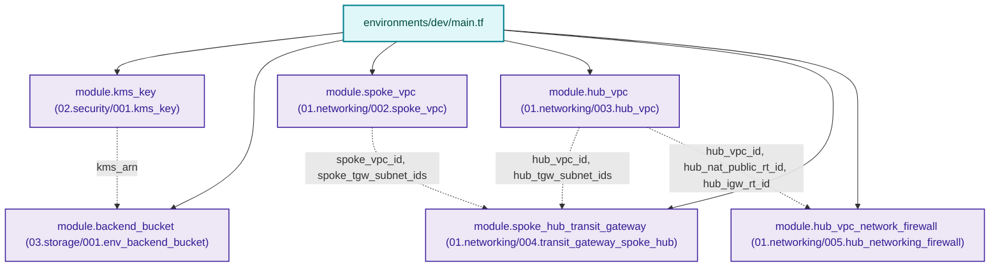

# Dev Environment: Databricks Hub-and-Spoke Networking

---

## 1. Executive Summary

- **Purpose & Scope**:
  This environment configuration orchestrates the complete development (`dev`) deployment of the **Databricks Hub-and-Spoke Network Architecture** on AWS. It provisions a dedicated Customer-Managed Spoke VPC for Databricks compute clusters, an Inspection & Egress Hub VPC with AWS Network Firewall, an AWS Transit Gateway interconnect, a Customer Managed KMS key, and a secured remote Terraform state backend.
- **Problem Statement & Solution**:
  Standard cloud networking architectures often allow direct outbound internet connectivity from compute clusters, introducing risks of data exfiltration and non-compliance with corporate security standards. In this `dev` environment, all outbound traffic originating from Databricks Spark clusters is forced across the AWS Transit Gateway into the Hub VPC, where stateful AWS Network Firewall rule groups enforce domain allowlists before egressing through NAT and Internet Gateways.
- **Key Business & Security Outcomes**:
  - **No Public Cluster Footprint**: Databricks worker nodes are strictly contained within private subnets without public IP addresses.
  - **Stateful Domain Allowlisting**: All internet traffic is filtered against an explicit whitelist of Databricks control plane endpoints, repository mirrors, and permitted S3 buckets.
  - **Dynamic Multi-AZ Infrastructure**: Configured with dynamic availability zone discovery (`data.aws_availability_zones.available_azs`) ensuring high availability and multi-AZ resilience.
  - **Hardened State Storage**: Dedicated S3 bucket encrypted with a customer-managed KMS key and automatic 90-day non-current version lifecycle expiration.

---

## 2. General Logic & Operational Flow

### 2.1 Provisioning Lifecycle
1. **Security & State Backend**:
   The `kms_key` module provisions a CMK (`alias/vpc_networking_backend_kms_key-dev`). The `backend_bucket` module creates an encrypted, versioned S3 bucket with 90-day version lifecycle expiration for Terraform state management.
2. **Network Foundation Deployment**:
   The `spoke_vpc` module provisions the customer-managed VPC (`10.1.0.0/16`), private compute subnets (`10.1.1.0/24`), TGW attachment subnets (`10.1.2.0/24`), cluster security groups, and VPC endpoints (S3 Gateway, STS Interface, Kinesis Interface).
   Concurrently, the `hub_vpc` module provisions the inspection VPC (`10.0.0.0/20`), public NAT subnets (`10.0.2.0/24`), firewall subnets (`10.0.3.0/24`), and TGW attachment subnets (`10.0.1.0/24`), along with an Elastic IP and NAT Gateway.
3. **Interconnect & Central Routing**:
   The `spoke_hub_transit_gateway` module establishes the AWS Transit Gateway, attaches both VPCs via their respective TGW subnets, and configures default route propagation so that Spoke traffic `0.0.0.0/0` directs into the Transit Gateway.
4. **Firewall Inspection & Egress Steering**:
   The `hub_vpc_network_firewall` module creates the AWS Network Firewall instance in the Hub firewall subnets and installs stateful rule groups containing Databricks FQDN allowlists. Symmetric routing directs traffic between the NAT Gateway and Network Firewall endpoints.

### 2.2 Network & Traffic Flow
- **Egress Path (Databricks Worker -> External SaaS / Repositories)**:
  `spoke_db_private_subnet` (`10.1.1.0/24`) $\rightarrow$ Route Table (`0.0.0.0/0` to TGW) $\rightarrow$ `Transit Gateway` $\rightarrow$ `hub_tgw_private_subnet` (`10.0.1.0/24`) $\rightarrow$ `hub_nat` (NAT Gateway) $\rightarrow$ `hub_vpc_network_firewall` (VPC Endpoint) $\rightarrow$ `hub-igw` (Internet Gateway) $\rightarrow$ Internet.
- **Internal AWS Services Path**:
  - S3 Storage: Routed directly via Gateway VPC Endpoint in the Spoke VPC route table.
  - STS & Kinesis: Handled directly within the Spoke VPC via Interface VPC Endpoints (`com.amazonaws.eu-central-1.sts` and `com.amazonaws.eu-central-1.kinesis-streams`).

---

## 3. Architecture of the Dev Environment

### 3.1 Network Topology & Subnet Breakdown

| VPC | Subnet Name | CIDR Block | Availability Zone | Route Target / Next Hop |
|:---|:---|:---:|:---:|:---|
| **Hub VPC** | `hub-tgw-private-dev-eu-central-1a` | `10.0.1.0/24` | `eu-central-1a` | NAT Gateway (`hub-nat-dev`) |
| **Hub VPC** | `hub-nat-public-dev-eu-central-1a` | `10.0.2.0/24` | `eu-central-1a` | Network Firewall Endpoint (`vpce`) |
| **Hub VPC** | `hub-firewall-public-dev-eu-central-1a` | `10.0.3.0/24` | `eu-central-1a` | Internet Gateway (`hub-igw-dev`) |
| **Spoke VPC** | `spoke-db-private-dev-eu-central-1a` | `10.1.1.0/24` | `eu-central-1a` | Transit Gateway (`tgw-spoke-hub-dev`) |
| **Spoke VPC** | `spoke-tgw-private-dev-eu-central-1a` | `10.1.2.0/24` | `eu-central-1a` | Transit Gateway Attachment |

### 3.2 Security Groups & Rule Sets
- **`default_spoke_sg-dev`**:
  - Ingress: Self-referencing TCP/UDP across all ports for inter-cluster communication.
  - Egress: Self-referencing intra-cluster traffic; TCP egress on port 443 (HTTPS), port 3306 (Hive Metastore), and port 6666 (Secure Cluster Connectivity).
- **AWS Network Firewall Rules**:
  - Stateful rule group filtering HTTP/HTTPS hostnames against Databricks control plane endpoints (`frankfurt.cloud.databricks.com`, etc.), package managers (PyPI, CRAN), and S3 regional endpoints.

---

## 4. Architecture C4 Visualisation

### 4.1 Level 1: System Context Diagram

### 4.2 Level 2: Container / Network Infrastructure Diagram

### 4.3 Level 3: Component Diagram (Terraform Module Orchestration)

---

## 5. All Modules Used with Short Summaries

### 5.1 Module Inventory

| Module Identifier | Source Directory | Responsibility | Key Input Dependencies |
|:---|:---|:---|:---|
| `module.kms_key` | [`../../modules/02.security/001.kms_key`](file:///modules/02.security/001.kms_key) | Provisions customer-managed KMS key for backend state and encryption. | `environment`, `kms_key_alias` |
| `module.backend_bucket` | [`../../modules/03.storage/001.env_backend_bucket`](file:///modules/03.storage/001.env_backend_bucket) | S3 state bucket with SSE-KMS, object versioning, 90-day lifecycle expiration, and public access block. | `kms_key_arn`, `bucket_name` |
| `module.spoke_vpc` | [`../../modules/01.networking/002.spoke_vpc`](file:///modules/01.networking/002.spoke_vpc) | Customer-managed Spoke VPC with private subnets, security groups, and VPC endpoints. | `spoke_cidr_block`, `availability_zones` |
| `module.hub_vpc` | [`../../modules/01.networking/003.hub_vpc`](file:///modules/01.networking/003.hub_vpc) | Inspection Hub VPC with NAT Gateway, IGW, and subnets for TGW and Firewall. | `hub_cidr_block`, `availability_zones` |
| `module.spoke_hub_transit_gateway` | [`../../modules/01.networking/004.transit_gateway_spoke_hub`](file:///modules/01.networking/004.transit_gateway_spoke_hub) | Interconnects Spoke and Hub VPCs with centralized route propagation. | `hub_vpc_id`, `spoke_vpc_id`, subnet IDs |
| `module.hub_vpc_network_firewall` | [`../../modules/01.networking/005.hub_networking_firewall`](file:///modules/01.networking/005.hub_networking_firewall) | Provisions AWS Network Firewall and stateful FQDN allowlists. | `hub_vpc_id`, `whitelisted_urls` |

---

## 6. Terraform Documentation Interface

> [!NOTE]
> The full machine-generated Terraform interface (Providers, Modules, Inputs, Outputs, and Resource definitions) for this environment is maintained by `terraform-docs` via pre-commit hooks in [`TERRAFORM.md`](./TERRAFORM.md).

### 6.1 Essential Inputs Summary

| Variable | Type | Description | Current Dev Value |
|:---|:---:|:---|:---|
| `aws_account_id` | `string` | Allowed AWS Account ID preventing deployment to wrong account | Set via CLI or `terraform.tfvars` |
| `aws_region` | `string` | Target AWS deployment region | `\"eu-central-1\"` |
| `environment` | `string` | Environment name qualifier | `\"dev\"` |
| `profile` | `string` | AWS CLI profile name | `\"default\"` |

---

## 7. Important Links and Resources

### 7.1 Authoritative Databricks Documentation
- [Databricks AWS E2 Firewall Hub and Spoke Architecture Guide](https://github.com/databricks/terraform-provider-databricks/blob/main/docs/guides/aws-e2-firewall-hub-and-spoke.md)
- [Databricks on AWS Official Documentation](https://docs.databricks.com/aws/en/)
- [Databricks Customer-Managed VPC Configuration Guide](https://docs.databricks.com/aws/en/administration-guide/cloud-configurations/aws/customer-managed-vpc)
- [Databricks Classic Private Connectivity & PrivateLink](https://docs.databricks.com/aws/en/security/network/classic/privatelink)

### 7.2 Authoritative AWS Documentation
- [AWS Official Documentation](https://docs.aws.amazon.com/)
- [AWS Network Firewall Developer Guide](https://docs.aws.amazon.com/network-firewall/latest/developerguide/what-is-aws-network-firewall.html)
- [AWS Transit Gateway Documentation](https://docs.aws.amazon.com/vpc/latest/tgw/what-is-transit-gateway.html)
- [AWS Well-Architected Framework](https://aws.amazon.com/architecture/well-architected/)

### 7.3 Project Documentation References
- [Project Root Documentation](file:///README.md)
- [Project Instructions & Source of Truth](file:///.ai/instructions.md)
- [Authoritative README Template](file:///.ai/README_TEMPLATE.md)
