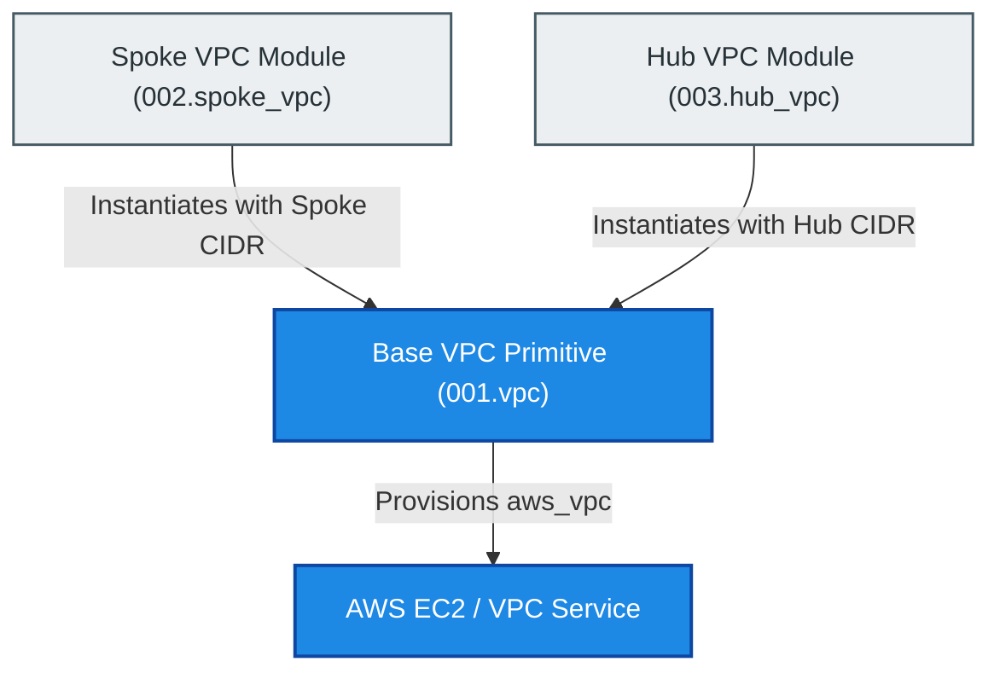
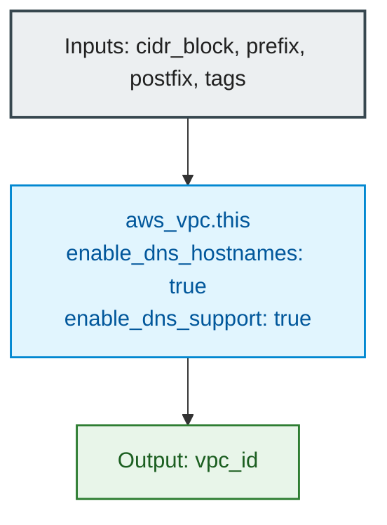

# Base Amazon VPC Module (`001.vpc`)

---

## 1. Executive Summary

- **Purpose & Scope**:
  This module provides a fundamental Amazon Virtual Private Cloud (VPC) resource primitive. It establishes an isolated virtual network baseline with enforced DNS hostnames and DNS resolution support, forming the core networking foundation for both Databricks Spoke VPCs and Hub inspection VPCs.
- **Problem Statement & Solution**:
  Databricks on AWS mandates specific VPC-level DNS attributes (`enableDnsHostnames = true` and `enableDnsSupport = true`) to enable internal cluster communication, Secure Cluster Connectivity (SCC), and private AWS endpoint resolution. This module encapsulates these requirements into a standardized, reusable component, preventing configuration drift across environments and VPC types.
- **Key Business & Security Outcomes**:
  - **Databricks Network Compliance**: Enforces required DNS capabilities out of the box.
  - **Standardized Tagging & Naming**: Automatically composes resource names from prefix and postfix variables.
  - **Clean Reusability**: Acts as the shared VPC engine for both Spoke compute VPCs and Hub inspection VPCs.

---

## 2. General Logic & Operational Flow

### 2.1 Provisioning Lifecycle
1. **Input Ingestion**: The module accepts the IPv4 `cidr_block`, `prefix`, `postfix` (typically environment name), and resource `tags`.
2. **VPC Creation**: An `aws_vpc` resource is initialized with DNS hostnames and DNS support explicitly enabled.
3. **Identifier Export**: The generated AWS VPC identifier is exported as `vpc_id` for consumption by subnet, routing, and endpoint modules.

### 2.2 Role in Network Topology
This module does not create subnets or route tables directly; it acts as the parent container. Higher-level modules (such as [`002.spoke_vpc`](file:///modules/01.networking/002.spoke_vpc) and [`003.hub_vpc`](file:///modules/01.networking/003.hub_vpc)) instantiate this module and layer subnets, internet gateways, NAT gateways, and Transit Gateway attachments within it.

---

## 3. Architecture of the Module

### 3.1 Resource Architecture & Configuration

| Resource Type | Resource Identifier | Key Attributes | Purpose |
|:---|:---|:---|:---|
| `aws_vpc` | `this` | `cidr_block = var.cidr_block` `enable_dns_hostnames = true` `enable_dns_support = true` | Root virtual private cloud isolation boundary |

### 3.2 Security & DNS Posture
- **DNS Resolution**: `enable_dns_support = true` ensures Amazon Route 53 Resolver resolves AWS domain names and private endpoint queries.
- **DNS Hostnames**: `enable_dns_hostnames = true` guarantees that compute instances launched within the VPC obtain private DNS hostnames, required for Databricks cluster nodes.

---

## 4. Architecture C4 Visualisation

### 4.1 Level 1: System Context Diagram

### 4.2 Level 2: Component Diagram

---

## 5. All Modules Used with Short Summaries

This is a foundational leaf module. It does not invoke any submodules.

- **Consumers**:
  - [`002.spoke_vpc`](file:///modules/01.networking/002.spoke_vpc) - Uses this module to provision the customer-managed Databricks compute VPC.
  - [`003.hub_vpc`](file:///modules/01.networking/003.hub_vpc) - Uses this module to provision the central inspection Hub VPC.

---

## 6. Terraform Documentation Interface

> [!NOTE]
> The full machine-generated Terraform interface (Providers, Resources, Inputs, and Outputs) is maintained by `terraform-docs` in [`TERRAFORM.md`](./TERRAFORM.md).

### 6.1 Essential Inputs Summary

| Variable | Type | Description | Required |
|:---|:---:|:---|:---:|
| `cidr_block` | `string` | The CIDR block for the VPC | Yes |
| `prefix` | `string` | Prefix for the VPC Name tag | Yes |
| `postfix` | `string` | Postfix for the VPC Name tag (typically environment) | Yes |
| `tags` | `map(string)` | Additional resource tags | No |

### 6.2 Essential Outputs Summary

| Output | Type | Description |
|:---|:---:|:---|
| `vpc_id` | `string` | The ID of the created VPC |

---

## 7. Important Links and Resources

### 7.1 Authoritative Documentation
- [Amazon VPC Official Documentation](https://docs.aws.amazon.com/vpc/latest/userguide/what-is-amazon-vpc.html) - AWS VPC user guide.
- [Databricks Customer-Managed VPC Guide](https://docs.databricks.com/aws/en/administration-guide/cloud-configurations/aws/customer-managed-vpc) - Required VPC configurations for Databricks compute.
- [Terraform AWS VPC Resource](https://registry.terraform.io/providers/hashicorp/aws/latest/docs/resources/vpc) - Terraform provider documentation for `aws_vpc`.

### 7.2 Internal References
- [Terraform Contract (`TERRAFORM.md`)](./TERRAFORM.md)
- [Base VPC Primitive (`001.vpc`)](file:///modules/01.networking/001.vpc)
- [Authoritative README Template](file:///.ai/README_TEMPLATE.md)
