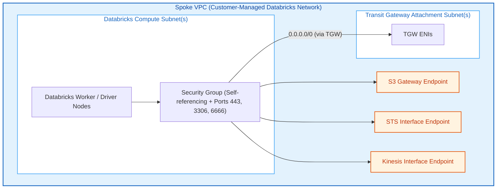
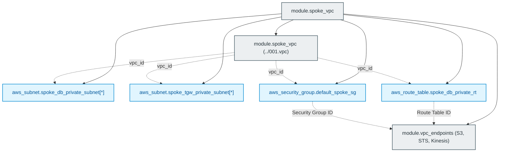

# Databricks Customer-Managed Spoke VPC Module (`002.spoke_vpc`)

---

## 1. Executive Summary

- **Purpose & Scope**:
  This module deploys a fully compliant **Databricks Customer-Managed Spoke VPC** on AWS. It provisions isolated private compute subnets for Databricks data plane clusters, dedicated subnets for AWS Transit Gateway (TGW) attachment, VPC endpoints (Amazon S3 Gateway, AWS STS Interface, Amazon Kinesis Interface), and self-referencing cluster security groups.
- **Problem Statement & Solution**:
  Databricks clusters require high-bandwidth communication between driver and worker nodes, secure outbound connectivity to the Databricks control plane, and fast access to cloud object storage without exposing worker nodes to the public internet. This module solves this by enforcing a strictly private subnet topology, keeping internal traffic on AWS private endpoints and routing external traffic through the Transit Gateway to a centralized inspection firewall.
- **Key Business & Security Outcomes**:
  - **No Public IP Addresses**: Compute instances are provisioned exclusively in private subnets with `map_public_ip_on_launch = false`.
  - **Direct S3 Gateway Routing**: High-throughput S3 traffic routes directly within the VPC without incurring NAT Gateway data processing fees.
  - **PrivateLink for Critical AWS Services**: STS and Kinesis Interface Endpoints isolate credential vending and telemetry from internet traversal.
  - **Compliant Intra-Cluster Security Group**: Implements self-referencing ingress/egress rules required for Spark inter-node networking.

---

## 2. General Logic & Operational Flow

### 2.1 Provisioning Lifecycle
1. **Base VPC Creation**: Calls the [`../001.vpc`](file:///modules/01.networking/001.vpc) module to provision the VPC container with DNS hostnames and DNS support enabled.
2. **Subnet Slicing**:
   - Provisions `aws_subnet.spoke_db_private_subnet` across the specified availability zones for Databricks compute nodes.
   - Provisions `aws_subnet.spoke_tgw_private_subnet` across availability zones for the AWS Transit Gateway VPC attachment.
3. **Route Table & Association**:
   Creates `aws_route_table.spoke_db_private_rt`, attaches private compute subnets to it, and sets it as the VPC's main route table.
4. **Security Group Configuration**:
   Creates `aws_security_group.default_spoke_sg` with self-referencing rules for all internal protocols, plus outbound TCP egress for HTTPS (443), Metastore (3306), and SCC Relay (6666).
5. **VPC Endpoints Deployment**:
   Deploys an S3 Gateway Endpoint attached to the compute route table, plus Interface Endpoints for STS and Kinesis attached to the compute subnets.

### 2.2 Network & Traffic Flow
- **Intra-Cluster Traffic**: Spark workers communicate directly with the driver across private subnets via the self-referencing security group.
- **S3 Data Access**: Routed directly to Amazon S3 via the Gateway VPC Endpoint prefix list in the private route table.
- **AWS API Traffic**: Authenticates via the local STS Interface Endpoint.
- **Egress / Control Plane Traffic**: Default route (`0.0.0.0/0`) directing into the AWS Transit Gateway is added downstream by the [`004.spoke_hub_tgw`](file:///modules/01.networking/004.spoke_hub_tgw) module.

---

## 3. Architecture of the Module

### 3.1 Subnet Architecture

| Subnet Group | Sizing / CIDR | Public IP? | Primary Function |
|:---|:---:|:---:|:---|
| `spoke_db_private_subnet` | `/24` or `/18` | **No** | Reserved strictly for Databricks Spark clusters and workspace compute. |
| `spoke_tgw_private_subnet` | `/28` or `/24` | **No** | Reserved for AWS Transit Gateway ENIs connecting Spoke to Hub. |

### 3.2 Security Group Rules (`default_spoke_sg`)

| Direction | Protocol | Port Range | Source / Destination | Purpose |
|:---|:---:|:---:|:---|:---|
| **Ingress** | All (`-1` or configured) | All | `self = true` | Cluster inter-node communication (Spark Shuffle, RPC). |
| **Egress** | All (`-1` or configured) | All | `self = true` | Cluster inter-node communication. |
| **Egress** | TCP | `443` | `0.0.0.0/0` | HTTPS traffic to Databricks control plane & authorized APIs. |
| **Egress** | TCP | `3306` | `0.0.0.0/0` | External Hive Metastore connections (if enabled). |
| **Egress** | TCP | `6666` | `0.0.0.0/0` | Secure Cluster Connectivity (SCC) relay. |

---

## 4. Architecture C4 Visualisation

### 4.1 Level 2: Container / Network Diagram

### 4.2 Level 3: Component Diagram (Terraform Resources)

---

## 5. All Modules Used with Short Summaries

### 5.1 Submodules Invoked

| Module Name | Source Path | Version | Primary Responsibility |
|:---|:---|:---:|:---|
| `module.spoke_vpc` | [`../001.vpc`](file:///modules/01.networking/001.vpc) | Local | Creates the underlying Amazon VPC resource with DNS attributes enabled. |
| `module.vpc_endpoints` | `terraform-aws-modules/vpc/aws//modules/vpc-endpoints` | `3.11.0` | Creates AWS S3 Gateway endpoint and Interface endpoints for STS & Kinesis. |

---

## 6. Terraform Documentation Interface

> [!NOTE]
> Detailed inputs, outputs, provider requirements, and resource mappings are generated automatically by `terraform-docs` in [`TERRAFORM.md`](./TERRAFORM.md).

### 6.1 Essential Inputs Summary

| Variable | Type | Description |
|:---|:---:|:---|
| `spoke_cidr_block` | `string` | CIDR block for the entire Spoke VPC |
| `spoke_db_private_subnets_cidr` | `list(string)` | CIDR blocks for Databricks compute private subnets |
| `spoke_tgw_private_subnets_cidr` | `list(string)` | CIDR blocks for Transit Gateway attachment subnets |
| `availability_zones` | `list(string)` | Target availability zones for subnet deployment |
| `env` | `string` | Environment name suffix (e.g., `dev`) |

### 6.2 Essential Outputs Summary

| Output | Type | Description |
|:---|:---:|:---|
| `spoke_vpc_id` | `string` | ID of the created Databricks Spoke VPC |
| `spoke_tgw_subnet_ids` | `list(string)` | List of subnet IDs reserved for Transit Gateway attachment |
| `spoke_db_private_rt_id` | `string` | ID of the Databricks compute route table |

---

## 7. Important Links and Resources

### 7.1 Authoritative Documentation
- [Databricks Customer-Managed VPC Guide](https://docs.databricks.com/aws/en/administration-guide/cloud-configurations/aws/customer-managed-vpc) - Official Databricks specifications for VPCs and subnets.
- [Databricks Classic Private Connectivity & PrivateLink](https://docs.databricks.com/aws/en/security/network/classic/privatelink) - VPC endpoint configuration.
- [AWS VPC Endpoints User Guide](https://docs.aws.amazon.com/vpc/latest/privatelink/vpc-endpoints.html) - AWS documentation on Gateway and Interface endpoints.

### 7.2 Internal References
- [Terraform Contract (`TERRAFORM.md`)](./TERRAFORM.md)
- [Base VPC Primitive (`001.vpc`)](file:///modules/01.networking/001.vpc)
- [Authoritative README Template](file:///.ai/README_TEMPLATE.md)
