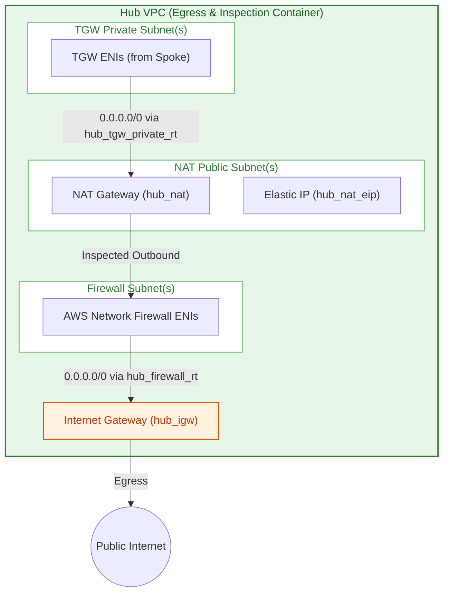
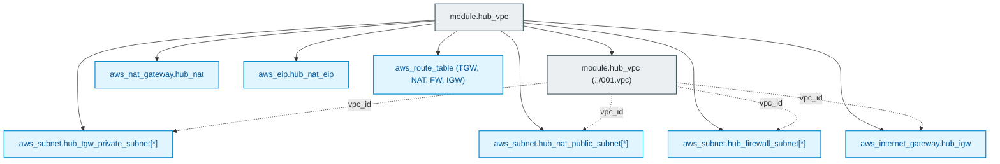

# Centralized Inspection & Egress Hub VPC Module (`003.hub_vpc`)

---

## 1. Executive Summary

- **Purpose & Scope**:
  This module provisions the centralized **Hub VPC** dedicated to network traffic inspection and controlled outbound egress for enterprise Databricks deployments. It sets up dedicated subnets for AWS Transit Gateway (TGW) attachments, public subnets housing AWS NAT Gateways and Elastic IPs, dedicated subnets for AWS Network Firewall endpoints, an Internet Gateway (IGW), and the core routing tables required for symmetric traffic steering.
- **Problem Statement & Solution**:
  In a multi-VPC Databricks architecture, decentralizing NAT gateways and internet egress across each spoke VPC increases operational costs and complicates security enforcement. This module establishes a single, centralized egress Hub that receives all outbound spoke traffic via Transit Gateway, passes it through inspection subnets, and routes it out to the internet through controlled NAT Gateways.
- **Key Business & Security Outcomes**:
  - **Centralized Security Perimeter**: All outbound Internet traffic must pass through this Hub VPC, providing a single choke point for monitoring and auditing.
  - **Symmetric Routing Infrastructure**: Prepares edge route tables (IGW ingress route table and NAT route tables) required by AWS Network Firewall to inspect both outbound requests and return packets.
  - **Cost Optimization**: Consolidates NAT Gateway footprint across multiple Databricks workspaces and environments.

---

## 2. General Logic & Operational Flow

### 2.1 Provisioning Lifecycle
1. **VPC Container**: Instantiates the [`../001.vpc`](file:///modules/01.networking/001.vpc) module with the configured Hub CIDR block.
2. **Subnet Segmentation**:
   - `hub_tgw_private_subnet`: Receives transit traffic coming across the AWS Transit Gateway.
   - `hub_firewall_subnet`: Houses the AWS Network Firewall endpoints deployed by [`005.networking_firewall`](file:///modules/01.networking/005.networking_firewall).
   - `hub_nat_public_subnet`: Public subnets containing Elastic IPs and NAT Gateways.
3. **Egress Gateway Provisioning**:
   Provisions `aws_internet_gateway.hub_igw`, allocates an Elastic IP (`aws_eip.hub_nat_eip`), and deploys `aws_nat_gateway.hub_nat`.
4. **Routing Architecture**:
   - Directs `0.0.0.0/0` from the private TGW subnet into the NAT Gateway.
   - Directs `0.0.0.0/0` from the firewall subnet into the Internet Gateway.
   - Establishes edge association for `aws_route_table.hub_igw_rt` on the Internet Gateway.

### 2.2 Network & Traffic Flow
- **Ingress from Spoke**: Traffic from Databricks arrives via Transit Gateway into `hub_tgw_private_subnet`.\n- **Forward to NAT**: The TGW private route table forwards default traffic (`0.0.0.0/0`) to the NAT Gateway.
- **Firewall Endpoint Steering**: Routes configured in [`005.networking_firewall`](file:///modules/01.networking/005.networking_firewall) route NAT outbound packets to the Network Firewall endpoint, and IGW ingress return packets back through the firewall endpoint.

---

## 3. Architecture of the Module

### 3.1 Subnet Architecture

| Subnet Identifier | Type | Auto Public IP? | Purpose |
|:---|:---:|:---:|:---|
| `hub_tgw_private_subnet` | Private | No | Dedicated attachment point for AWS Transit Gateway ENIs |
| `hub_nat_public_subnet` | Public | Yes | Hosts NAT Gateways and egress Elastic IPs |
| `hub_firewall_subnet` | Private | No | Hosts AWS Network Firewall VPC endpoint ENIs |

### 3.2 Route Tables & Associations

| Route Table | Associated Subnet / Target | Destination CIDR | Target / Next Hop |
|:---|:---|:---:|:---|
| `hub_tgw_private_rt` | `hub_tgw_private_subnet` | `0.0.0.0/0` | NAT Gateway (`hub_nat`) |
| `hub_nat_public_rt` | `hub_nat_public_subnet` | `0.0.0.0/0` | Wired to Network Firewall (by `005.networking_firewall`) |
| `hub_firewall_rt` | `hub_firewall_subnet` | `0.0.0.0/0` | Internet Gateway (`hub_igw`) |
| `hub_igw_rt` | Gateway: `hub_igw` | Spoke/NAT CIDRs | Wired to Network Firewall (by `005.networking_firewall`) |

---

## 4. Architecture C4 Visualisation

### 4.1 Level 2: Hub VPC Container Diagram

### 4.2 Level 3: Component Diagram (Terraform Resources)

---

## 5. All Modules Used with Short Summaries

### 5.1 Submodules Invoked

| Module Name | Source Path | Primary Role |
|:---|:---|:---|\n| `module.hub_vpc` | [`../001.vpc`](file:///modules/01.networking/001.vpc) | Provisions the root AWS VPC with DNS resolution and DNS hostnames enabled. |

---

## 6. Terraform Documentation Interface

> [!NOTE]
> Machine-generated interface specifications for this module are maintained by `terraform-docs` in [`TERRAFORM.md`](./TERRAFORM.md).

### 6.1 Essential Inputs Summary

| Variable | Type | Description |
|:---|:---:|:---|
| `hub_cidr_block` | `string` | IPv4 CIDR block for the Hub VPC |
| `hub_tgw_private_subnets_cidr` | `list(string)` | CIDR blocks for TGW attachment subnets |
| `hub_nat_public_subnets_cidr` | `list(string)` | CIDR blocks for public NAT Gateway subnets |
| `hub_firewall_subnets_cidr` | `list(string)` | CIDR blocks for AWS Network Firewall subnets |
| `availability_zones` | `list(string)` | Target availability zones |

### 6.2 Essential Outputs Summary

| Output | Type | Description |
|:---|:---:|:---|
| `hub_vpc_id` | `string` | The ID of the Hub VPC |
| `hub_tgw_subnet_ids` | `list(string)` | Subnet IDs for TGW attachment in Hub |
| `hub_firewall_subnet_ids` | `list(string)` | Subnet IDs for Network Firewall endpoints |
| `hub_tgw_private_rt_id` | `string` | ID of the Hub TGW private route table |
| `hub_nat_public_rt_id` | `string` | ID of the Hub public NAT route table |
| `hub_igw_rt_id` | `string` | ID of the Hub Internet Gateway edge route table |

---

## 7. Important Links and Resources

### 7.1 Authoritative Documentation
- [AWS Network Firewall Centralized Symmetric Architecture](https://docs.aws.amazon.com/network-firewall/latest/developerguide/arch-centralized-symmetric.html) - Egress inspection design patterns.
- [AWS NAT Gateway User Guide](https://docs.aws.amazon.com/vpc/latest/userguide/vpc-nat-gateway.html) - Managed NAT Gateways in AWS VPCs.
- [AWS Internet Gateway User Guide](https://docs.aws.amazon.com/vpc/latest/userguide/VPC_Internet_Gateway.html) - AWS IGW configuration.

### 7.2 Internal References
- [Terraform Contract (`TERRAFORM.md`)](./TERRAFORM.md)
- [Base VPC Primitive (`001.vpc`)](file:///modules/01.networking/001.vpc)
- [Authoritative README Template](file:///.ai/README_TEMPLATE.md)
