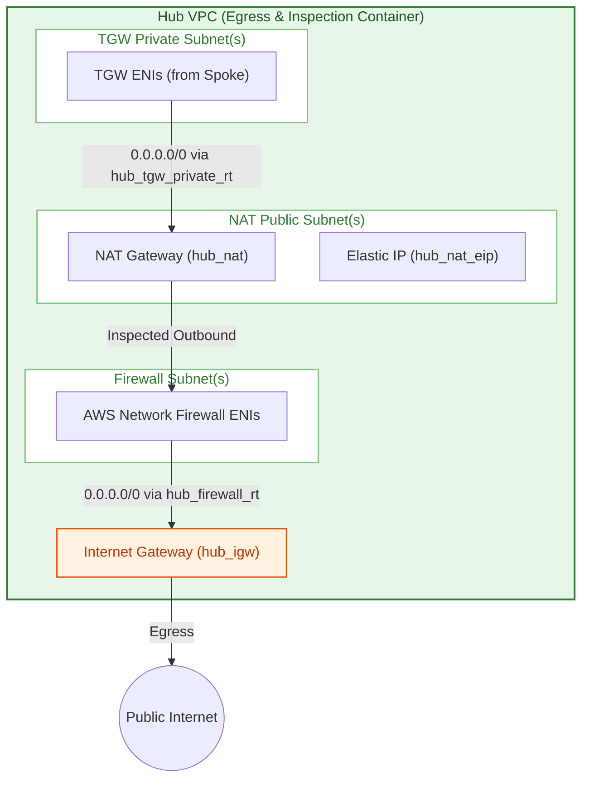
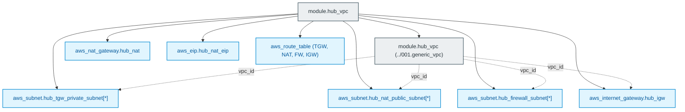

# Central Inspection Hub VPC Module (`003.hub_vpc`)

---

## 1. Executive Summary

- **Purpose & Scope**:
  This module provisions the centralized **Inspection & Egress Hub VPC** within the Databricks Hub-and-Spoke network topology. It establishes dedicated subnet tiers for AWS Transit Gateway (TGW) attachments, AWS Network Firewall inspection endpoints, and public NAT/Internet Gateways, orchestrating the route table framework required for centralized egress filtering.
- **Problem Statement & Solution**:
  In an enterprise multi-VPC architecture, distributing NAT Gateways and Internet Gateways across every compute spoke results in multiplied infrastructure costs and decentralized egress control. This module solves this by centralizing all egress routing into a hardened Hub VPC, ensuring that traffic originating from spoke workspaces can be intercepted and inspected symmetrically before reaching the public internet.
- **Key Business & Security Outcomes**:
  - **Centralized Egress Control**: Consolidates internet-bound egress routing through a single inspection point.
  - **Multi-Tier Subnet Isolation**: Maintains strict segregation between public gateway subnets, private transit routing subnets, and dedicated firewall endpoint subnets.
  - **Cost-Optimized Gateway Architecture**: Leverages centralized NAT Gateways rather than redundant egress gateways per spoke VPC.

---

## 2. General Logic & Operational Flow

### 2.1 Configuration & Provisioning Lifecycle
1. **Base VPC Deployment**: Instantiates [`../001.generic_vpc`](file:///modules/01.networking/001.generic_vpc) to create the Hub VPC container with DNS hostnames and DNS support enabled.
2. **Subnet Segmentation**:
   - `hub_tgw_private_subnet`: Dedicated subnets for AWS Transit Gateway ENI attachments.
   - `hub_firewall_subnet`: Dedicated subnets for AWS Network Firewall endpoint ENIs.
   - `hub_nat_public_subnet`: Public subnets for NAT Gateways and Elastic IPs.
3. **Egress Gateway Provisioning**:
   Provisions `aws_internet_gateway.hub_igw`, allocates an Elastic IP (`aws_eip.hub_nat_eip`), and deploys `aws_nat_gateway.hub_nat` in [`vpc_hub_gateways.tf`](file:///modules/01.networking/003.hub_vpc/vpc_hub_gateways.tf).
4. **Routing Architecture**:
   In [`vpc_hub_route_tables.tf`](file:///modules/01.networking/003.hub_vpc/vpc_hub_route_tables.tf), associates subnets with dedicated route tables:
   - `hub_tgw_private_rt`: Directs default egress (`0.0.0.0/0`) from the TGW attachment subnets to the NAT Gateway.
   - `hub_firewall_rt`: Directs default egress (`0.0.0.0/0`) from the firewall subnets to the Internet Gateway.
   - `hub_igw_rt`: Edge association on the Internet Gateway reserved for reverse inspection routing.

### 2.2 Network & Traffic Flow
- **Ingress from Spoke**: Traffic from Databricks arrives via Transit Gateway into `hub_tgw_private_subnet`.
- **Forward to NAT**: The TGW private route table forwards default traffic (`0.0.0.0/0`) to the NAT Gateway.
- **Firewall Endpoint Steering**: Downstream routes configured in [`005.hub_networking_firewall`](file:///modules/01.networking/005.hub_networking_firewall) route NAT outbound packets to the Network Firewall endpoint, and IGW ingress return packets back through the firewall endpoint.

---

## 3. Architecture of the Module

### 3.1 Subnet Architecture

| Subnet Identifier | Configuration Variable | Auto Public IP? | Purpose |
|:---|:---|:---:|:---|
| `hub_tgw_private_subnet` | `hub_tgw_private_subnets_cidr` | No | Dedicated attachment point for AWS Transit Gateway ENIs |
| `hub_nat_public_subnet` | `hub_nat_public_subnets_cidr` | Yes | Hosts NAT Gateways and egress Elastic IPs |
| `hub_firewall_subnet` | `hub_firewall_subnets_cidr` | No | Hosts AWS Network Firewall VPC endpoint ENIs |

### 3.2 Route Tables & Associations

| Route Table | Associated Subnet / Target | Destination CIDR | Target / Next Hop |
|:---|:---|:---:|:---|
| `hub_tgw_private_rt` | `hub_tgw_private_subnet` | `0.0.0.0/0` | NAT Gateway (`hub_nat`) |
| `hub_nat_public_rt` | `hub_nat_public_subnet` | `0.0.0.0/0` | Wired to Network Firewall (by [`005.hub_networking_firewall`](file:///modules/01.networking/005.hub_networking_firewall)) |
| `hub_firewall_rt` | `hub_firewall_subnet` | `0.0.0.0/0` | Internet Gateway (`hub_igw`) |
| `hub_igw_rt` | Gateway Edge: `hub_igw` | Spoke / NAT CIDRs | Wired to Network Firewall (by [`005.hub_networking_firewall`](file:///modules/01.networking/005.hub_networking_firewall)) |

---

## 4. Architecture C4 Visualisation

### 4.1 Level 2: Hub VPC Container Diagram

### 4.2 Level 3: Component Diagram (Terraform Resources)

---

## 5. All Modules Used with Short Summaries

### 5.1 Submodules Invoked

| Module Name | Source Path | Primary Role |
|:---|:---|:---|
| `module.hub_vpc` | [`../001.generic_vpc`](file:///modules/01.networking/001.generic_vpc) | Provisions the root AWS VPC with DNS resolution and DNS hostnames enabled. |

---

## 6. Terraform Documentation Interface

> [!NOTE]
> Machine-generated interface specifications for this module are maintained by `terraform-docs` in [`TERRAFORM.md`](./TERRAFORM.md).

### 6.1 Essential Inputs Summary

| Variable | Type | Description | Required |
|:---|:---:|:---|:---:|
| `hub_cidr_block` | `string` | IPv4 CIDR block for the Hub VPC | Yes |
| `hub_tgw_private_subnets_cidr` | `list(string)` | CIDR blocks for TGW attachment subnets | Yes |
| `hub_nat_public_subnets_cidr` | `list(string)` | CIDR blocks for public NAT Gateway subnets | Yes |
| `hub_firewall_subnets_cidr` | `list(string)` | CIDR blocks for AWS Network Firewall subnets | Yes |
| `availability_zones` | `list(string)` | Target availability zones | Yes |
| `env` | `string` | Environment name qualifier (e.g. `dev`) | Yes |
| `name_prefix` | `string` | Name prefix for Hub VPC (default: `"Hub VPC"`) | No |

### 6.2 Essential Outputs Summary

| Output | Type | Description |
|:---|:---:|:---|
| `hub_vpc_id` | `string` | The ID of the Hub VPC |
| `hub_tgw_subnet_ids` | `list(string)` | Subnet IDs for TGW attachment in Hub |
| `hub_firewall_subnet_ids` | `list(string)` | Subnet IDs for Network Firewall endpoints |
| `hub_tgw_private_rt_id` | `string` | ID of the Hub TGW private route table |
| `hub_nat_public_rt_id` | `string` | ID of the Hub public NAT route table |
| `hub_igw_rt_id` | `string` | ID of the Hub Internet Gateway edge route table |

---

## 7. Important Links and Resources

### 7.1 Authoritative Documentation
- [AWS Network Firewall Centralized Symmetric Architecture](https://docs.aws.amazon.com/network-firewall/latest/developerguide/arch-centralized-symmetric.html) - Egress inspection design patterns.
- [AWS NAT Gateway User Guide](https://docs.aws.amazon.com/vpc/latest/userguide/vpc-nat-gateway.html) - Managed NAT Gateways in AWS VPCs.
- [AWS Internet Gateway User Guide](https://docs.aws.amazon.com/vpc/latest/userguide/VPC_Internet_Gateway.html) - AWS IGW configuration.

### 7.2 Internal References
- [Terraform Contract (`TERRAFORM.md`)](./TERRAFORM.md)
- [Base VPC Primitive (`001.generic_vpc`)](file:///modules/01.networking/001.generic_vpc)
- [Authoritative README Template](file:///.ai/README_TEMPLATE.md)
