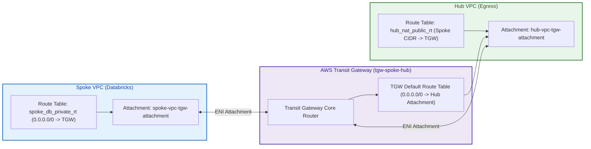
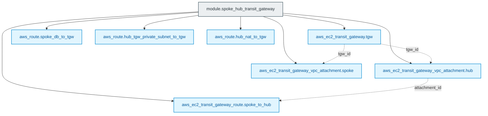

# AWS Transit Gateway Interconnect Module (`004.spoke_hub_tgw`)

---

## 1. Executive Summary

- **Purpose & Scope**:
  This module provisions the central **AWS Transit Gateway (TGW)** and configures the bidirectional VPC attachments and route propagations linking the Databricks Customer-Managed Spoke VPC to the centralized Inspection Hub VPC.
- **Problem Statement & Solution**:
  Without a transit router, connecting multiple Databricks Spoke VPCs to a central egress firewall requires complex mesh VPC peering connections that do not support transitive routing. AWS Transit Gateway acts as a highly scalable cloud router that simplifies the topology, enabling transitive packet routing from Spoke compute clusters directly into the Hub inspection engine and back.
- **Key Business & Security Outcomes**:
  - **Transitive Egress Routing**: Seamlessly directs `0.0.0.0/0` from private Spoke subnets through the Transit Gateway into the Hub VPC.
  - **Symmetric Return Routing**: Establishes reverse routes from Hub private and NAT subnets back to the Spoke CIDR via the Transit Gateway.
  - **Multi-Spoke Scalability**: Provides a standardized hub-and-spoke interconnect capable of attaching dozens of additional Databricks workspaces without architectural changes.

---

## 2. General Logic & Operational Flow

### 2.1 Provisioning Lifecycle
1. **Transit Gateway Initialization**:
   Deploys `aws_ec2_transit_gateway.tgw` with DNS support, automatic attachment acceptance, and default route table association/propagation enabled.
2. **VPC Attachments**:
   - Creates `aws_ec2_transit_gateway_vpc_attachment.hub` targeting the Hub VPC and its designated TGW subnets.
   - Creates `aws_ec2_transit_gateway_vpc_attachment.spoke` targeting the Spoke VPC and its designated TGW subnets.
3. **Route Configuration**:
   - **TGW Route Table**: Adds a default route `0.0.0.0/0` targeting the Hub VPC attachment.
   - **Spoke Route Table**: Injects a default route `0.0.0.0/0` in the Databricks private compute route table pointing to the Transit Gateway.
   - **Hub Route Tables**: Injects reverse routes for the `spoke_cidr_block` in both the Hub TGW private route table and the Hub NAT public route table pointing to the Transit Gateway.

### 2.2 Network Traffic Flow
- **Outbound Packet**:
  Spoke Worker $\rightarrow$ `spoke_db_private_rt` (`0.0.0.0/0` to TGW) $\rightarrow$ TGW $\rightarrow$ TGW Route Table (`0.0.0.0/0` to Hub Attachment) $\rightarrow$ `hub_tgw_private_subnet` in Hub VPC.
- **Return Packet**:
  NAT Gateway in Hub $\rightarrow$ `hub_nat_public_rt` (`spoke_cidr_block` to TGW) $\rightarrow$ TGW $\rightarrow$ Spoke VPC attachment $\rightarrow$ Spoke Worker.

---

## 3. Architecture of the Module

### 3.1 Transit Gateway Attachments & Routing Matrix

| Route Location | Route Table Target | Destination CIDR | Next Hop Target |
|:---|:---|:---:|:---|
| **Transit Gateway** | Default Association RT | `0.0.0.0/0` | Hub VPC Attachment (`aws_ec2_transit_gateway_vpc_attachment.hub`) |
| **Spoke VPC** | `spoke_db_private_rt` | `0.0.0.0/0` | Transit Gateway (`aws_ec2_transit_gateway.tgw`) |
| **Hub VPC** | `hub_tgw_private_rt` | `spoke_cidr_block` | Transit Gateway (`aws_ec2_transit_gateway.tgw`) |
| **Hub VPC** | `hub_nat_public_rt` | `spoke_cidr_block` | Transit Gateway (`aws_ec2_transit_gateway.tgw`) |

---

## 4. Architecture C4 Visualisation

### 4.1 Level 2: Transit Gateway Interconnect Diagram

### 4.2 Level 3: Component Diagram (Terraform Resources)

---

## 5. All Modules Used with Short Summaries

This module directly provisions native AWS Transit Gateway resources without invoking external submodules.

- **Dependencies**:
  - Requires `hub_vpc_id` and `hub_tgw_subnet_ids` from [`003.hub_vpc`](file:///modules/01.networking/003.hub_vpc).
  - Requires `spoke_vpc_id` and `spoke_tgw_subnet_ids` from [`002.spoke_vpc`](file:///modules/01.networking/002.spoke_vpc).

---

## 6. Terraform Documentation Interface

> [!NOTE]
> The full machine-generated Terraform interface (Providers, Resources, Inputs, and Outputs) is maintained by `terraform-docs` in [`TERRAFORM.md`](./TERRAFORM.md).

### 6.1 Essential Inputs Summary

| Variable | Type | Description |
|:---|:---:|:---|
| `hub_vpc_id` | `string` | VPC ID of the Hub VPC |
| `hub_tgw_subnet_ids` | `list(string)` | Subnet IDs in the Hub VPC reserved for TGW attachment |
| `spoke_vpc_id` | `string` | VPC ID of the Databricks Spoke VPC |
| `spoke_tgw_subnet_ids` | `list(string)` | Subnet IDs in the Spoke VPC reserved for TGW attachment |
| `spoke_cidr_block` | `string` | IPv4 CIDR block of the Spoke VPC for return routing |
| `spoke_db_private_rt_id` | `string` | ID of the Spoke compute route table to inject the default route |
| `hub_nat_public_rt_id` | `string` | ID of the Hub NAT route table to inject the reverse return route |
| `hub_tgw_private_rt_id` | `string` | ID of the Hub TGW route table to inject the reverse return route |

---

## 7. Important Links and Resources

### 7.1 Authoritative Documentation
- [AWS Transit Gateway Documentation](https://docs.aws.amazon.com/vpc/latest/tgw/what-is-transit-gateway.html) - Official AWS guide to Transit Gateway.
- [How Transit Gateways Work](https://docs.aws.amazon.com/vpc/latest/tgw/how-transit-gateways-work.html) - Packet routing and attachment mechanics.
- [Building Scalable Multi-VPC AWS Networks with TGW](https://docs.aws.amazon.com/whitepapers/latest/building-scalable-secure-multi-vpc-network-infrastructure/aws-transit-gateway.html) - AWS architectural whitepaper.

### 7.2 Internal References
- [Terraform Contract (`TERRAFORM.md`)](./TERRAFORM.md)
- [Authoritative README Template](file:///.ai/README_TEMPLATE.md)
