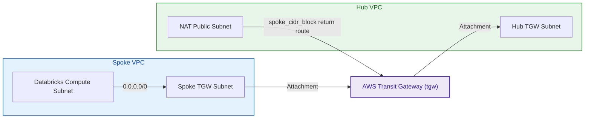
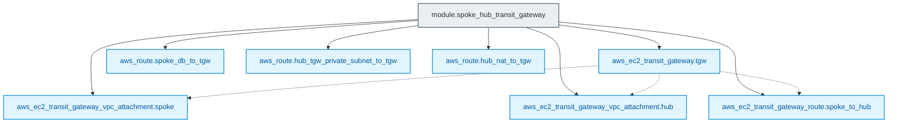

# Spoke-Hub AWS Transit Gateway Module (`004.transit_gateway_spoke_hub`)

---

## 1. Executive Summary

- **Purpose & Scope**:
  This module deploys and configures the central **AWS Transit Gateway (TGW)** interconnect linking the Databricks Customer-Managed Spoke VPC with the Central Inspection Hub VPC. It manages VPC attachments, Transit Gateway route tables, and cross-VPC route injections to establish symmetric routing between Databricks compute and the central egress firewall.
- **Problem Statement & Solution**:
  Databricks compute clusters in the Spoke VPC must route all outbound traffic through the centralized inspection firewall in the Hub VPC, while ensuring response packets return correctly without asymmetric routing drops. This module establishes dedicated Transit Gateway VPC attachments, injects a default route (`0.0.0.0/0`) into the Spoke compute route tables targeting the TGW, and injects reverse return routes into the Hub route tables.
- **Key Business & Security Outcomes**:
  - **Symmetric Cross-VPC Routing**: Ensures clean transit routing between Spoke and Hub without routing loops or stateful packet drops.
  - **Scalable Multi-Spoke Topology**: Easily accommodates additional spoke VPCs (e.g. staging, prod, ML workspaces) attaching to the same hub.
  - **Isolated Attachment Subnets**: Attachments are bound to dedicated `/28` private subnets in both VPCs, adhering to AWS Well-Architected networking standards.

---

## 2. General Logic & Operational Flow

### 2.1 Configuration & Provisioning Lifecycle
1. **Transit Gateway Instantiation**: Provisions `aws_ec2_transit_gateway.tgw` with default route table association and propagation enabled.
2. **VPC Attachments**:
   - `aws_ec2_transit_gateway_vpc_attachment.spoke`: Attaches the Databricks Spoke VPC using its dedicated TGW subnets.
   - `aws_ec2_transit_gateway_vpc_attachment.hub`: Attaches the Central Hub VPC using its dedicated TGW subnets.
3. **Transit Gateway Default Routing**:
   Provisions `aws_ec2_transit_gateway_route.spoke_to_hub`, routing all default traffic (`0.0.0.0/0`) across the TGW to the Hub attachment.
4. **VPC Route Injections**:
   - Injects default route (`0.0.0.0/0`) in `spoke_db_private_rt` pointing to the Transit Gateway.
   - Injects return routes for `spoke_cidr_block` in `hub_tgw_private_rt` and `hub_nat_public_rt` pointing to the Transit Gateway.

### 2.2 Network & Traffic Flow
- **Outbound Packet Flow**: Databricks cluster $\rightarrow$ `spoke_db_private_rt` (`0.0.0.0/0`) $\rightarrow$ AWS Transit Gateway $\rightarrow$ Hub Attachment $\rightarrow$ Hub VPC `hub_tgw_private_rt` $\rightarrow$ NAT Gateway $\rightarrow$ Network Firewall $\rightarrow$ Internet.
- **Inbound Return Flow**: Internet $\rightarrow$ Network Firewall $\rightarrow$ NAT Gateway $\rightarrow$ Hub VPC `hub_nat_public_rt` (`spoke_cidr_block`) $\rightarrow$ Transit Gateway $\rightarrow$ Spoke Attachment $\rightarrow$ Databricks cluster.

---

## 3. Architecture of the Module

### 3.1 Routing Matrix

| Route Table | Destination CIDR | Target / Next Hop | Flow Direction |
|:---|:---:|:---|:---:|
| `spoke_db_private_rt` | `0.0.0.0/0` | `aws_ec2_transit_gateway.tgw` | Outbound Egress |
| TGW Default Route Table | `0.0.0.0/0` | `aws_ec2_transit_gateway_vpc_attachment.hub` | Inter-VPC Transit |
| `hub_tgw_private_rt` | `spoke_cidr_block` | `aws_ec2_transit_gateway.tgw` | Return Path |
| `hub_nat_public_rt` | `spoke_cidr_block` | `aws_ec2_transit_gateway.tgw` | Return Path |

---

## 4. Architecture C4 Visualisation

### 4.1 Level 2: Interconnect Container Diagram

### 4.2 Level 3: Component Diagram (Terraform Resources)

---

## 5. All Modules Used with Short Summaries

This module does not instantiate external submodules. It provisions native AWS EC2 Transit Gateway resources and injects routes into route tables created by [`002.spoke_vpc`](file:///modules/01.networking/002.spoke_vpc) and [`003.hub_vpc`](file:///modules/01.networking/003.hub_vpc).

---

## 6. Terraform Documentation Interface

> [!NOTE]
> Machine-generated interface specifications for this module are maintained by `terraform-docs` in [`TERRAFORM.md`](./TERRAFORM.md).

### 6.1 Essential Inputs Summary

| Variable | Type | Description | Required |
|:---|:---:|:---|:---:|
| `spoke_vpc_id` | `string` | Spoke VPC identifier | Yes |
| `spoke_tgw_subnet_ids` | `list(string)` | Subnets in Spoke VPC for TGW attachment | Yes |
| `spoke_db_private_rt_id` | `string` | Route table ID for Databricks compute in Spoke | Yes |
| `spoke_cidr_block` | `string` | CIDR block of Spoke VPC for return routing | Yes |
| `hub_vpc_id` | `string` | Hub VPC identifier | Yes |
| `hub_tgw_subnet_ids` | `list(string)` | Subnets in Hub VPC for TGW attachment | Yes |
| `hub_tgw_private_rt_id` | `string` | Route table ID for Hub TGW subnets | Yes |
| `hub_nat_public_rt_id` | `string` | Route table ID for Hub NAT public subnets | Yes |
| `env` | `string` | Environment name qualifier (e.g. `dev`) | Yes |

### 6.2 Essential Outputs Summary

This module does not export outputs.

---

## 7. Important Links and Resources

### 7.1 Authoritative Documentation
- [AWS Transit Gateway User Guide](https://docs.aws.amazon.com/vpc/latest/tgw/what-is-transit-gateway.html) - Official AWS Transit Gateway manual.
- [Building Scalable and Secure Multi-VPC AWS Network Infrastructure](https://docs.aws.amazon.com/whitepapers/latest/building-scalable-secure-multi-vpc-network-infrastructure/welcome.html) - AWS whitepaper.
- [Databricks Centralized Egress with Transit Gateway](https://github.com/databricks/terraform-provider-databricks/blob/main/docs/guides/aws-e2-firewall-hub-and-spoke.md) - Reference pattern.

### 7.2 Internal References
- [Terraform Contract (`TERRAFORM.md`)](./TERRAFORM.md)
- [Spoke VPC Module (`002.spoke_vpc`)](file:///modules/01.networking/002.spoke_vpc)
- [Hub VPC Module (`003.hub_vpc`)](file:///modules/01.networking/003.hub_vpc)
- [Authoritative README Template](file:///.ai/README_TEMPLATE.md)
