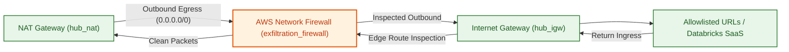
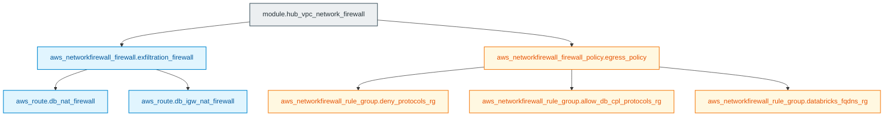

# Hub AWS Network Firewall Module (`005.hub_networking_firewall`)

---

## 1. Executive Summary

- **Purpose & Scope**:
  This module implements a centralized, stateful **AWS Network Firewall** inside the Hub VPC to safeguard Databricks compute egress. It inspects all outbound internet traffic originating from Databricks compute clusters, enforcing domain allowlists (FQDNs), strict protocol filtering, and preventing data exfiltration to unauthorized endpoints.
- **Problem Statement & Solution**:
  Databricks clusters require outbound connectivity to AWS package registries, Databricks Control Plane endpoints, metastore databases, and cloud storage, but allowing uninspected outbound egress poses high data exfiltration and compliance risks. This module solves this by inserting an AWS Network Firewall with stateful Suricata-compatible inspection into the egress traffic path, ensuring only explicitly allowlisted domain targets are reachable.
- **Key Business & Security Outcomes**:
  - **Data Exfiltration Prevention**: Outbound HTTP/S traffic is restricted strictly to allowlisted Databricks infrastructure and corporate domains.
  - **Protocol Hardening**: Drops prohibited protocols (e.g. ICMP, FTP, SSH) at the perimeter.
  - **Symmetric Egress & Ingress Inspection**: Configures symmetric VPC routing between the Hub NAT Gateway, Firewall Endpoint, and Internet Gateway.

---

## 2. General Logic & Operational Flow

### 2.1 Configuration & Provisioning Lifecycle
1. **Rule Group Definitions** (in [`network_firewall_rule_groups.tf`](file:///modules/01.networking/005.hub_networking_firewall/network_firewall_rule_groups.tf)):
   - `deny_protocols_rg`: Stateful rule group dropping blocked protocols (ICMP, FTP, SSH).
   - `allow_db_cpl_protocols_rg`: Stateful rule group permitting outbound TCP communication between Spoke/Hub CIDRs and Databricks control plane endpoints.
   - `databricks_fqdns_rg`: Stateful domain list rule group permitting HTTP/HTTPS egress only to allowlisted Databricks regional endpoints and external domains.
2. **Firewall Policy & Firewall Creation** (in [`main.tf`](file:///modules/01.networking/005.hub_networking_firewall/main.tf)):
   - Provisions `aws_networkfirewall_firewall_policy.egress_policy`, associating the stateful rule groups in prioritized order.
   - Provisions `aws_networkfirewall_firewall.exfiltration_firewall` across the Hub VPC firewall subnets.
3. **Endpoint Routing Interception** (in [`network_firewall_route_tables.tf`](file:///modules/01.networking/005.hub_networking_firewall/network_firewall_route_tables.tf)):
   - Reads the generated VPC endpoint via `data.aws_vpc_endpoint.firewall`.
   - Injects route in `hub_nat_public_rt` directing default egress (`0.0.0.0/0`) into the firewall endpoint.
   - Injects ingress routing in `hub_igw_rt` routing return traffic destined for `hub_nat_public_subnets_cidr` into the firewall endpoint.

### 2.2 Network & Traffic Flow
- **Outbound Egress Path**: NAT Gateway $\rightarrow$ `hub_nat_public_rt` (`0.0.0.0/0`) $\rightarrow$ Network Firewall Endpoint $\rightarrow$ Firewall Subnet Route Table $\rightarrow$ Internet Gateway.
- **Inbound Return Path**: Internet Gateway $\rightarrow$ `hub_igw_rt` (`hub_nat_public_subnets_cidr`) $\rightarrow$ Network Firewall Endpoint $\rightarrow$ NAT Gateway.

---

## 3. Architecture of the Module

### 3.1 Firewall Rule Groups & Priority

| Rule Group | Type | Priority | Action | Target / Matching |
|:---|:---:|:---:|:---:|:---|
| `deny_protocols_rg` | Stateful (5-tuple) | `100` | `DROP` | Protocols: ICMP, FTP, SSH |
| `allow_db_cpl_protocols_rg` | Stateful (5-tuple) | `200` | `PASS` | TCP traffic to Databricks Control Plane |
| `databricks_fqdns_rg` | Stateful (Domain List) | `300` | `ALLOW` | SNI / HTTP Host allowlist (`whitelisted_urls`, Databricks URLs, S3 URLs) |

### 3.2 Symmetric Routing Points

| Route Resource | Route Table | Destination | Target Next Hop |
|:---|:---|:---:|:---|
| `aws_route.db_nat_firewall` | `hub_nat_public_rt` | `0.0.0.0/0` | `vpc_endpoint_id` (Firewall) |
| `aws_route.db_igw_nat_firewall` | `hub_igw_rt` | `hub_nat_public_subnets_cidr` | `vpc_endpoint_id` (Firewall) |

---

## 4. Architecture C4 Visualisation

### 4.1 Level 2: Inspection Data Path

### 4.2 Level 3: Component Diagram (Terraform Resources)

---

## 5. All Modules Used with Short Summaries

This module does not invoke external submodules. It provisions AWS Network Firewall resources, policies, rule groups, and route table associations directly.

---

## 6. Terraform Documentation Interface

> [!NOTE]
> Complete inputs, outputs, dependencies, and provider requirements are managed by `terraform-docs` in [`TERRAFORM.md`](./TERRAFORM.md).

### 6.1 Essential Inputs Summary

| Variable | Type | Description | Required |
|:---|:---:|:---|:---:|
| `db_resources_map` | `map(string)` | Databricks regional endpoints (web_app, tunnel, rds, control_plane) | Yes |
| `whitelisted_urls` | `list(string)` | FQDN domains permitted through the egress filter | Yes |
| `whitelisted_bucket_names` | `list(string)` | Storage bucket names permitted for S3 egress | Yes |
| `hub_vpc_id` | `string` | Hub VPC identifier | Yes |
| `hub_firewall_subnet_ids` | `list(string)` | Subnets hosting firewall endpoint ENIs | Yes |
| `hub_nat_public_rt_id` | `string` | Route table ID for Hub NAT public subnets | Yes |
| `hub_igw_rt_id` | `string` | Edge route table ID on Hub Internet Gateway | Yes |
| `env` | `string` | Environment name qualifier (e.g. `dev`) | Yes |

### 6.2 Essential Outputs Summary

This module does not export outputs.

---

## 7. Important Links and Resources

### 7.1 Authoritative Documentation
- [Databricks Central Firewall Reference Guide](https://github.com/databricks/terraform-provider-databricks/blob/main/docs/guides/aws-e2-firewall-hub-and-spoke.md) - Official Databricks firewall reference.
- [AWS Network Firewall Developer Guide](https://docs.aws.amazon.com/network-firewall/latest/developerguide/what-is-aws-network-firewall.html) - Technical guide for AWS Network Firewall.
- [Suricata Documentation](https://suricata.io/) - Stateful inspection rule syntax and standards.

### 7.2 Internal References
- [Terraform Contract (`TERRAFORM.md`)](./TERRAFORM.md)
- [Hub VPC Module (`003.hub_vpc`)](file:///modules/01.networking/003.hub_vpc)
- [Authoritative README Template](file:///.ai/README_TEMPLATE.md)
