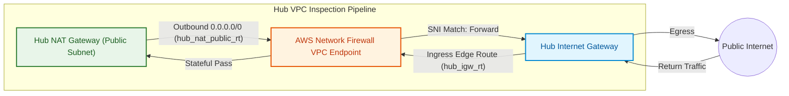
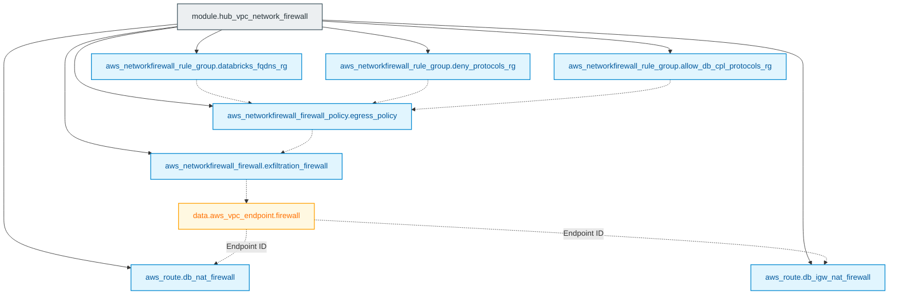

# AWS Network Firewall Egress Inspection Module (`005.networking_firewall`)

---

## 1. Executive Summary

- **Purpose & Scope**:
  This module deploys an enterprise-grade **AWS Network Firewall** inside the Hub VPC. It configures stateful firewall rule groups enforcing strict domain (FQDN) allowlisting, protocol inspection, data exfiltration prevention, and symmetric route steering between the Hub NAT Gateway and Internet Gateway.
- **Problem Statement & Solution**:
  Data exfiltration is one of the highest risks in cloud analytics environments. Allowing unrestricted outbound internet access from compute clusters enables rogue code or compromised libraries to upload sensitive data to unapproved destinations. This module eliminates this risk by intercepting all egress traffic and validating HTTP/HTTPS Server Name Indication (SNI) against an authorized whitelist of Databricks control plane endpoints, package repositories, and verified S3 storage buckets.
- **Key Business & Security Outcomes**:
  - **Data Exfiltration Prevention**: Outbound traffic to arbitrary IP addresses or unauthorized domains is blocked by default.
  - **Databricks Control Plane Allowlisting**: Enforces exact FQDN rules required for Databricks workspace management, Secure Cluster Connectivity (SCC), and telemetry.
  - **Symmetric Traffic Inspection**: Ingress routing on the Internet Gateway and egress routing on the NAT Gateway guarantee that inspection is performed symmetrically on both legs of a connection.

---

## 2. General Logic & Operational Flow

### 2.1 Provisioning Lifecycle
1. **Rule Group Definition**:
   - `databricks_fqdns_rg`: Stateful rule group with domain list rules (`whitelisted_urls` and `whitelisted_bucket_names` mapped as S3 domain targets).
   - `deny_protocols_rg`: Stateful rule group dropping non-compliant protocols.
   - `allow_db_cpl_protocols_rg`: Stateful rule group allowing authorized control plane traffic.
2. **Firewall Policy Compilation**:
   An `aws_networkfirewall_firewall_policy` resource combines the stateful rule groups and sets `stateless_default_actions = ["aws:forward_to_sfe"]` to ensure seamless stateful inspection.
3. **Firewall Deployment**:
   Deploys `aws_networkfirewall_firewall.exfiltration_firewall` across the Hub VPC's firewall subnets.
4. **Endpoint Resolution & Route Steering**:
   A data source queries the provisioned VPC endpoint (`AWSNetworkFirewallManaged = true`), then injects:
   - Route in `hub_nat_public_rt` directing `0.0.0.0/0` through the firewall endpoint.
   - Route in `hub_igw_rt` directing return traffic for the NAT subnets through the firewall endpoint.

### 2.2 Network Traffic Flow
- **Outbound (NAT -> Firewall -> Internet)**:
  Packets exiting `hub_nat` destined for `0.0.0.0/0` are routed to the AWS Network Firewall VPC endpoint. The stateful engine inspects the TLS SNI or HTTP Host header. If matched in the FQDN allowlist, the packet is forwarded to `hub_igw`.
- **Return (Internet -> Firewall -> NAT)**:
  Return packets arriving at `hub_igw` for the NAT public subnet CIDRs are intercepted by the IGW edge route table and sent to the Network Firewall endpoint before reaching the NAT Gateway.

---

## 3. Architecture of the Module

### 3.1 Firewall Rule Groups

| Rule Group | Type | Capacity | Primary Logic |
|:---|:---:|:---|:---|
| `databricks_fqdns_rg` | Stateful (DomainList) | 100 | Permits HTTP/HTTPS to whitelisted Databricks endpoints, PyPI, CRAN, and S3 bucket hostnames |
| `deny_protocols_rg` | Stateful (Standard) | 100 | Explicit drop rules for prohibited egress protocols |
| `allow_db_cpl_protocols_rg` | Stateful (Standard) | 100 | Pass rules for Databricks control plane ports and protocols |

### 3.2 Symmetric Routing Matrix

| Route Table | Destination CIDR | Target | Purpose |
|:---|:---:|:---|:---|
| `hub_nat_public_rt` | `0.0.0.0/0` | Network Firewall Endpoint (`data.aws_vpc_endpoint.firewall.id`) | Directs outbound internet traffic into firewall |
| `hub_igw_rt` | `hub_nat_public_subnets_cidr[*]` | Network Firewall Endpoint (`data.aws_vpc_endpoint.firewall.id`) | Directs return internet ingress into firewall |

---

## 4. Architecture C4 Visualisation

### 4.1 Level 2: Firewall Inspection Flow

### 4.2 Level 3: Component Diagram (Terraform Resources)

---

## 5. All Modules Used with Short Summaries

This module defines native AWS Network Firewall resources directly and does not invoke submodules.

- **Dependencies**:
  - Requires `hub_vpc_id`, `hub_nat_public_rt_id`, and `hub_igw_rt_id` from [`003.hub_vpc`](file:///modules/01.networking/003.hub_vpc).
  - Requires `whitelisted_urls` and `whitelisted_bucket_names` configured in the calling environment.

---

## 6. Terraform Documentation Interface

> [!NOTE]
> The complete machine-generated interface specification (Providers, Resources, Inputs, and Outputs) is maintained by `terraform-docs` in [`TERRAFORM.md`](./TERRAFORM.md).

### 6.1 Essential Inputs Summary

| Variable | Type | Description |
|:---|:---:|:---|
| `hub_vpc_id` | `string` | VPC ID of the Hub VPC where the firewall is deployed |
| `hub_firewall_subnet_ids` | `list(string)` | Firewall subnets for endpoint creation |
| `hub_nat_public_rt_id` | `string` | ID of the Hub NAT route table to inject the firewall default route |
| `hub_igw_rt_id` | `string` | ID of the Hub IGW route table to inject the symmetric ingress route |
| `whitelisted_urls` | `list(string)` | List of authorized FQDN hostnames for egress |
| `whitelisted_bucket_names` | `list(string)` | S3 bucket names permitted for access |

---

## 7. Important Links and Resources

### 7.1 Authoritative Documentation
- [AWS Network Firewall Documentation](https://docs.aws.amazon.com/network-firewall/latest/developerguide/what-is-aws-network-firewall.html) - AWS service guide.
- [AWS Centralized Symmetric Inspection Architecture](https://docs.aws.amazon.com/network-firewall/latest/developerguide/arch-centralized-symmetric.html) - Routing architectures for Network Firewall.
- [Databricks AWS E2 Firewall Guide](https://github.com/databricks/terraform-provider-databricks/blob/main/docs/guides/aws-e2-firewall-hub-and-spoke.md) - Official Databricks firewall reference.

### 7.2 Internal References
- [Terraform Contract (`TERRAFORM.md`)](./TERRAFORM.md)
- [Authoritative README Template](file:///.ai/README_TEMPLATE.md)
