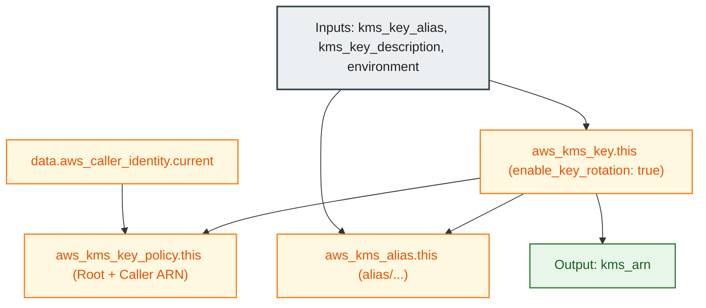

# AWS KMS Customer Managed Key Module (`001.kms_key`)

---

## 1. Executive Summary

- **Purpose & Scope**:
  This module deploys a hardened, customer-managed AWS Key Management Service (KMS) key (CMK), key policy, and alias. It establishes an envelope encryption foundation used to protect sensitive infrastructure state, Terraform remote backends, and storage buckets across deployment environments.
- **Problem Statement & Solution**:
  Default AWS-managed keys (such as `aws/s3`) lack granular access control delegation, cannot be shared across external IAM roles or accounts with custom conditions, and offer limited auditability. This module solves this by creating a dedicated customer-managed key with automated annual key rotation, root account policy delegation, caller identity permissions, and deletion prevention lifecycles.
- **Key Business & Security Outcomes**:
  - **Cryptographic Independence**: Full customer ownership over cryptographic keys and envelope encryption policies.
  - **Accidental Deletion Protection**: Terraform `prevent_destroy` lifecycle guarantees safeguard against accidental key destruction.
  - **Compliance Alignment**: Automatic key rotation and configurable deletion waiting windows (7 to 30 days).

---

## 2. General Logic & Operational Flow

### 2.1 Configuration & Provisioning Lifecycle
1. **Caller Identity Discovery**: Reads current account ID and caller ARN using `data.aws_caller_identity.current`.
2. **KMS Key Instantiation**: Creates `aws_kms_key.this` with automatic key rotation enabled (`enable_key_rotation = true`) and a 30-day deletion waiting period.
3. **Key Policy Attachment**: Configures `aws_kms_key_policy.this` granting:
   - Root account administrative permissions (`kms:*`).
   - IAM caller identity operational permissions for Terraform provisioning and state management.
4. **Alias Creation**: Creates `aws_kms_alias.this` formatting the key name as `alias/${var.kms_key_alias}-${var.environment}`.

### 2.2 Operational Use Cases
- **Terraform Remote State**: Passed into [`001.env_backend_bucket`](file:///modules/03.storage/001.env_backend_bucket) to enforce Server-Side Encryption with KMS (SSE-KMS) on the S3 bucket and state objects.
- **DynamoDB State Locks**: Can be used to encrypt state lock tables.

---

## 3. Architecture of the Module

### 3.1 Resource Architecture & Attributes

| Resource Type | Resource Identifier | Configuration Attributes | Security Role |
|:---|:---|:---|:---|
| `aws_kms_key` | `this` | `enable_key_rotation = true` `deletion_window_in_days = 30` `prevent_destroy = true` | Root cryptographic key |
| `aws_kms_key_policy` | `this` | Root account + Caller ARN policy delegation | Access control boundary |
| `aws_kms_alias` | `this` | `alias/${kms_key_alias}-${environment}` | Human-readable key reference |

---

## 4. Architecture C4 Visualisation

### 4.1 Level 2: Component Diagram

---

## 5. All Modules Used with Short Summaries

This module does not invoke any submodules. It provisions native AWS KMS resources directly.

- **Consumers**:
  - [`001.env_backend_bucket`](file:///modules/03.storage/001.env_backend_bucket) - Uses the resulting KMS Key ARN for S3 server-side encryption.
  - [`environments/dev`](file:///environments/dev) - Root environment orchestrator instantiating this CMK module.

---

## 6. Terraform Documentation Interface

> [!NOTE]
> Machine-generated interface specifications for this module are maintained by `terraform-docs` in [`TERRAFORM.md`](./TERRAFORM.md).

### 6.1 Essential Inputs Summary

| Variable | Type | Description | Required |
|:---|:---:|:---|:---:|
| `kms_key_alias` | `string` | Base alias name for the KMS key | Yes |
| `kms_key_description` | `string` | Custom description for the KMS key | Yes |
| `environment` | `string` | Environment qualifier (e.g. `dev`) | Yes |
| `enable_key_rotation` | `bool` | Enable annual automatic key rotation (default: `true`) | No |
| `deletion_window_in_days` | `number` | Waiting period before key destruction (7-30 days, default: `30`) | No |

### 6.2 Essential Outputs Summary

| Output | Type | Description |
|:---|:---:|:---|
| `kms_arn` | `string` | The Amazon Resource Name (ARN) of the created KMS key |

---

## 7. Important Links and Resources

### 7.1 Authoritative Documentation
- [AWS KMS Developer Guide](https://docs.aws.amazon.com/kms/latest/developerguide/overview.html) - AWS Key Management Service concepts.
- [AWS KMS Key Policies](https://docs.aws.amazon.com/kms/latest/developerguide/key-policies.html) - Policy architecture and best practices.
- [Terraform AWS KMS Key Resource](https://registry.terraform.io/providers/hashicorp/aws/latest/docs/resources/kms_key) - Provider documentation.

### 7.2 Internal References
- [Terraform Contract (`TERRAFORM.md`)](./TERRAFORM.md)
- [Remote Backend Bucket Module (`001.env_backend_bucket`)](file:///modules/03.storage/001.env_backend_bucket)
- [Authoritative README Template](file:///.ai/README_TEMPLATE.md)
