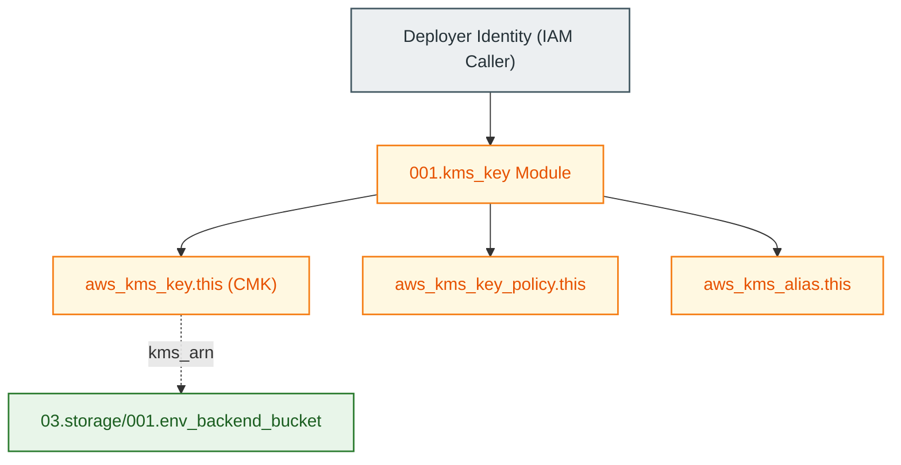

# Customer Managed KMS Key Module (`001.kms_key`)

---

## 1. Executive Summary

- **Purpose & Scope**:
  This module provisions a hardened AWS Key Management Service (KMS) **Customer Managed Key (CMK)**, associated key alias, and least-privilege resource key policy. It supplies the primary encryption key used for securing remote Terraform state files in Amazon S3, DynamoDB state lock records, and network logs.
- **Problem Statement & Solution**:
  Relying on AWS-managed default keys (`aws/s3`) prevents fine-grained access control, cross-account delegation, and compliance auditing. Customer Managed Keys grant the organization full ownership and cryptographic boundaries over encryption policies. This module automates CMK creation while enforcing automatic key rotation and accidental deletion prevention.
- **Key Business & Security Outcomes**:
  - **Accidental Deletion Protection**: Protected by Terraform `prevent_destroy = true` lifecycle blocks and configurable `deletion_window_in_days`.
  - **Automated Cryptographic Rotation**: Enables yearly automatic key rotation (`enable_key_rotation = true`).
  - **Granular IAM Key Delegation**: Scopes access to the AWS root account and calling deployer identity.

---

## 2. General Logic & Operational Flow

### 2.1 Provisioning Lifecycle
1. **Identity Resolution**: Queries `data.aws_caller_identity.current` to determine the current AWS Account ID and deployer ARN.
2. **Key Creation**: Provisions `aws_kms_key.this` with automatic rotation and deletion windows.
3. **Key Policy Attachment**: Attaches `aws_kms_key_policy.this` granting root management and caller administration.
4. **Alias Creation**: Creates `aws_kms_alias.this` with the environment-qualified alias name `alias/${var.kms_key_alias}-${var.environment}`.
5. **ARN Output**: Exports `kms_arn` for consumption by S3 backend buckets and other encrypted services.

---

## 3. Architecture of the Module

### 3.1 Resource Architecture

| Resource Type | Resource Identifier | Configuration Attributes | Purpose |
|:---|:---|:---|:---|
| `aws_kms_key` | `this` | `enable_key_rotation = true` `deletion_window_in_days = 30` `prevent_destroy = true` | Root cryptographic key material |
| `aws_kms_key_policy` | `this` | Root account + Calling IAM identity statements | Access control and delegation policy |
| `aws_kms_alias` | `this` | `alias/${var.kms_key_alias}-${var.environment}` | Human-readable key identifier |

---

## 4. Architecture C4 Visualisation

### 4.1 Level 2: Component Architecture

---

## 5. All Modules Used with Short Summaries

This module does not invoke submodules.

- **Consumers**:
  - [`modules/03.storage/001.env_backend_bucket`](file:///modules/03.storage/001.env_backend_bucket) - Uses this CMK for S3 Server-Side Encryption (SSE-KMS).
  - Calling environments (such as [`environments/dev`](file:///environments/dev)).

---

## 6. Terraform Documentation Interface

> [!NOTE]
> The full machine-generated interface specification is maintained by `terraform-docs` in [`TERRAFORM.md`](./TERRAFORM.md).

### 6.1 Essential Inputs Summary

| Variable | Type | Default | Description |
|:---|:---:|:---:|:---|
| `kms_key_alias` | `string` | n/a | Base alias name for the KMS key |
| `environment` | `string` | n/a | Environment name qualifier appended to alias |
| `enable_key_rotation` | `bool` | `true` | Enables annual key rotation |
| `deletion_window_in_days` | `number` | `30` | Waiting period (in days) before deletion |

### 6.2 Essential Outputs Summary

| Output | Type | Description |
|:---|:---:|:---|
| `kms_arn` | `string` | The Amazon Resource Name (ARN) of the created KMS key |

---

## 7. Important Links and Resources

### 7.1 Authoritative Documentation
- [AWS Key Management Service Overview](https://docs.aws.amazon.com/kms/latest/developerguide/overview.html) - KMS concepts and best practices.
- [AWS KMS Key Policies](https://docs.aws.amazon.com/kms/latest/developerguide/key-policies.html) - Guidance on least-privilege key policies.
- [Terraform AWS KMS Provider Docs](https://registry.terraform.io/providers/hashicorp/aws/latest/docs/resources/kms_key) - Terraform documentation for KMS resources.

### 7.2 Internal References
- [Terraform Contract (`TERRAFORM.md`)](./TERRAFORM.md)
- [Authoritative README Template](file:///.ai/README_TEMPLATE.md)
