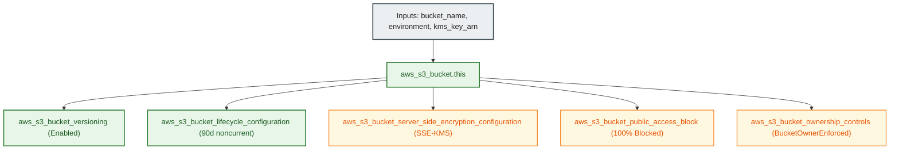

# Remote Terraform S3 Backend Bucket Module (`001.env_backend_bucket`)

---

## 1. Executive Summary

- **Purpose & Scope**:
  This module provisions a hardened Amazon S3 bucket dedicated to storing remote Terraform state files and infrastructure metadata. It implements strict enterprise security baselines: customer-managed KMS key encryption (SSE-KMS), enforced bucket versioning, total public access blocking, Bucket Owner Enforced ownership controls, and automated 90-day non-current version lifecycle cleanup.
- **Problem Statement & Solution**:
  Storing Terraform state files in unencrypted or publicly accessible object storage risks leaking sensitive credentials, resource IDs, and environment tokens. Furthermore, unbounded versioning without lifecycle rules leads to ever-accumulating storage costs. This module solves both problems by applying defense-in-depth bucket controls alongside automatic historical state version expiration after 90 days.
- **Key Business & Security Outcomes**:
  - **Zero Public Exposure**: Block Public Access settings (`block_public_acls`, `ignore_public_acls`, `block_public_policy`, `restrict_public_buckets`) are unconditionally enabled.
  - **At-Rest State Encryption**: Enforces Server-Side Encryption using customer-managed KMS keys (`aws:kms`).
  - **Disaster Recovery & Cost Control**: Object versioning preserves historical rollback points, while lifecycle policies expire non-current versions older than 90 days.
  - **Destruction Safeguards**: `prevent_destroy = true` lifecycle blocks accidental bucket deletion.

---

## 2. General Logic & Operational Flow

### 2.1 Configuration & Provisioning Lifecycle
1. **Bucket Initialization**: Creates `aws_s3_bucket.this` formatted as `${var.bucket_name}-${var.environment}`.
2. **Ownership Controls**: Applies `aws_s3_bucket_ownership_controls.this` setting `object_ownership = "BucketOwnerEnforced"` (disabling legacy S3 ACLs).
3. **Public Access Hardening**: Applies `aws_s3_bucket_public_access_block.this` blocking all public ACLs, policies, and queries.
4. **Versioning Activation**: Enables multi-version state tracking via `aws_s3_bucket_versioning.this`.
5. **KMS Encryption Enforcement**: Configures `aws_s3_bucket_server_side_encryption_configuration.this` utilizing the provided `kms_key_arn` and enabling bucket key optimization.
6. **Lifecycle Management**: Configures `aws_s3_bucket_lifecycle_configuration.this` with rule `cleanup-old-state-versions`, expiring non-current historical versions after 90 days.

### 2.2 Network & Operational Flow
Terraform CLI and CI/CD pipelines authenticate with AWS, assume the target deployment role, and read/write `.tfstate` binaries securely over TLS, encrypted at rest via the associated KMS key.

---

## 3. Architecture of the Module

### 3.1 Security & Lifecycle Controls

| Control Layer | Resource Type | Setting | Purpose |
|:---|:---|:---:|:---|
| **Encryption** | `aws_s3_bucket_server_side_encryption_configuration` | `SSE-KMS` (`bucket_key_enabled = true`) | Cryptographic protection via CMK |
| **Access Boundary** | `aws_s3_bucket_public_access_block` | All 4 flags `true` | Complete internet isolation |
| **Object Ownership** | `aws_s3_bucket_ownership_controls` | `BucketOwnerEnforced` | ACL deprecation and uniform ownership |
| **Version History** | `aws_s3_bucket_versioning` | `status = "Enabled"` | Rollback capability for state corruption |
| **Lifecycle Cleanup** | `aws_s3_bucket_lifecycle_configuration` | `noncurrent_days = 90` | Automatic expiration of stale versions |

---

## 4. Architecture C4 Visualisation

### 4.1 Level 2: Storage Container Diagram

---

## 5. All Modules Used with Short Summaries

This module does not invoke external submodules. It provisions native Amazon S3 bucket resources and security policies directly.

---

## 6. Terraform Documentation Interface

> [!NOTE]
> Detailed interface contracts for this module are maintained by `terraform-docs` in [`TERRAFORM.md`](./TERRAFORM.md).

### 6.1 Essential Inputs Summary

| Variable | Type | Description | Required |
|:---|:---:|:---|:---:|
| `bucket_name` | `string` | Base name for the S3 backend bucket | Yes |
| `environment` | `string` | Environment qualifier (e.g. `dev`) | Yes |
| `kms_key_arn` | `string` | Customer Managed Key ARN for state encryption | Yes |
| `force_destroy` | `bool` | Permit bucket deletion when non-empty (default: `false`) | No |
| `tags` | `map(string)` | Resource tags for the bucket | No |

### 6.2 Essential Outputs Summary

| Output | Type | Description |
|:---|:---:|:---|
| `bucket_id` | `string` | The ID / name of the S3 bucket |
| `bucket_arn` | `string` | The Amazon Resource Name (ARN) of the S3 bucket |
| `bucket_domain_name` | `string` | The bucket domain name |

---

## 7. Important Links and Resources

### 7.1 Authoritative Documentation
- [Amazon S3 User Guide](https://docs.aws.amazon.com/AmazonS3/latest/userguide/Welcome.html) - AWS documentation on Amazon S3.
- [Securing Amazon S3 Buckets](https://docs.aws.amazon.com/AmazonS3/latest/userguide/security-best-practices.html) - AWS security best practices.
- [Terraform S3 Backend Documentation](https://developer.hashicorp.com/terraform/language/settings/backends/s3) - Remote state storage configuration.

### 7.2 Internal References
- [Terraform Contract (`TERRAFORM.md`)](./TERRAFORM.md)
- [KMS Customer Managed Key Module (`001.kms_key`)](file:///modules/02.security/001.kms_key)
- [Authoritative README Template](file:///.ai/README_TEMPLATE.md)
