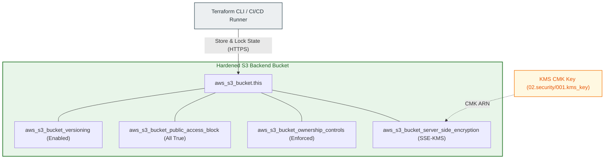

# S3 Remote State Backend Bucket Module (`001.env_backend_bucket`)

---

## 1. Executive Summary

- **Purpose & Scope**:
  This module provisions a production-hardened **Amazon S3 Bucket** purpose-built for storing Terraform remote state files (`terraform.tfstate`). It enforces mandatory object versioning, customer-managed KMS encryption (SSE-KMS) with S3 Bucket Keys, bucket ownership controls, and full S3 Block Public Access.
- **Problem Statement & Solution**:
  Terraform state files contain sensitive data, including resource attributes, private IP addresses, and potentially secrets. Storing state insecurely introduces severe data leakage and supply chain risks. This module automates the deployment of a fully compliant S3 backend bucket conforming to the AWS Well-Architected Framework and CIS security benchmarks.
- **Key Business & Security Outcomes**:
  - **Zero Public Access**: Configures `aws_s3_bucket_public_access_block` enabling all four public access prevention controls.
  - **State History & Rollback**: Enables object versioning (`aws_s3_bucket_versioning`) to protect against state corruption or accidental loss.
  - **Cost-Optimized KMS Encryption**: Employs AWS KMS CMKs with S3 Bucket Keys enabled, reducing KMS request API costs by up to 99%.
  - **Accidental Deletion Protection**: Enforces Terraform `prevent_destroy = true` lifecycle guards on the bucket and its security configurations.

---

## 2. General Logic & Operational Flow

### 2.1 Provisioning Lifecycle
1. **Naming Computation**: Computes the globally unique bucket name using `locals.tf` as `${var.bucket_name}-${var.environment}`.
2. **Bucket Creation**: Deploys `aws_s3_bucket.this` with environment tags and deletion protection.
3. **Versioning Configuration**: Enables object versioning to retain historical state versions.
4. **SSE-KMS Encryption**: Sets `aws:kms` as the default server-side encryption algorithm using the provided `kms_key_arn` and activates bucket keys.
5. **Security Hardening**: Enforces `BucketOwnerEnforced` ownership controls and activates all four S3 Block Public Access parameters.

---

## 3. Architecture of the Module

### 3.1 Security & Configuration Controls

| Control Component | Resource Type | Setting | Impact |
|:---|:---|:---:|:---|
| **Encryption at Rest** | `aws_s3_bucket_server_side_encryption_configuration` | `aws:kms` with CMK | Encrypts all state files with dedicated KMS key |
| **Bucket Key** | `aws_s3_bucket_server_side_encryption_configuration` | `bucket_key_enabled = true` | Minimizes KMS call volume and cost |
| **Object Versioning** | `aws_s3_bucket_versioning` | `status = "Enabled"` | Preserves previous state file snapshots |
| **Public Access Block** | `aws_s3_bucket_public_access_block` | All 4 flags `true` | Prevents any public exposure of state data |
| **Ownership Controls** | `aws_s3_bucket_ownership_controls` | `BucketOwnerEnforced` | Disables legacy S3 ACLs entirely |

---

## 4. Architecture C4 Visualisation

### 4.1 Level 2: Component Architecture

---

## 5. All Modules Used with Short Summaries

This module directly manages Amazon S3 resources and does not invoke external submodules.

- **Dependencies**:
  - Requires `kms_key_arn` from [`modules/02.security/001.kms_key`](file:///modules/02.security/001.kms_key).

---

## 6. Terraform Documentation Interface

> [!NOTE]
> The full machine-generated interface specification (Providers, Resources, Inputs, and Outputs) is maintained by `terraform-docs` in [`TERRAFORM.md`](./TERRAFORM.md).

### 6.1 Essential Inputs Summary

| Variable | Type | Description |
|:---|:---:|:---|
| `bucket_name` | `string` | Base name for the S3 bucket |
| `environment` | `string` | Environment qualifier appended to bucket name |
| `kms_key_arn` | `string` | ARN of the KMS key used for SSE-KMS encryption |
| `force_destroy` | `bool` | Whether to allow bucket destruction with objects present (default `false`) |

### 6.2 Essential Outputs Summary

| Output | Type | Description |
|:---|:---:|:---|
| `bucket_id` | `string` | The ID / name of the S3 bucket |
| `bucket_arn` | `string` | The ARN of the S3 bucket |
| `bucket_domain_name` | `string` | The bucket domain name |

---

## 7. Important Links and Resources

### 7.1 Authoritative Documentation
- [Amazon S3 Official Documentation](https://docs.aws.amazon.com/AmazonS3/latest/userguide/Welcome.html) - S3 user guide.
- [Terraform S3 Backend Configuration](https://developer.hashicorp.com/terraform/language/settings/backends/s3) - Official guide on configuring S3 as a remote backend.
- [Protecting Data with SSE-KMS](https://docs.aws.amazon.com/AmazonS3/latest/userguide/UsingKMSEncryption.html) - AWS documentation on SSE-KMS and S3 Bucket Keys.

### 7.2 Internal References
- [Terraform Contract (`TERRAFORM.md`)](./TERRAFORM.md)
- [Customer Managed KMS Key Module (`001.kms_key`)](file:///modules/02.security/001.kms_key)
- [Authoritative README Template](file:///.ai/README_TEMPLATE.md)
